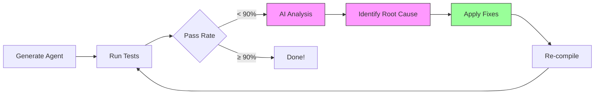
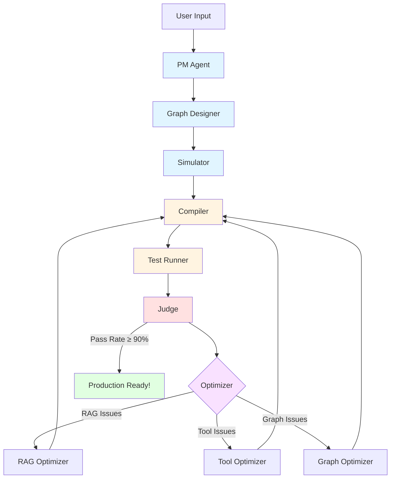

<div align="center">

# 🤖 IteraAgent

**One-Command Agent Factory: From Idea to Production in Minutes**

[](https://opensource.org/licenses/MIT)
[](https://www.python.org/downloads/)
[](https://github.com/langchain-ai/langgraph)
[](https://github.com/Olding1/IteraAgent)

*Fully automated AI agent factory with RAG, tool discovery, testing, and self-optimization*

> ⚠️ **Demo Stage**: This project is currently in demo/preview stage. Features are functional but may undergo significant changes. Use in production at your own risk.

[Quick Start](#-quick-start-3-steps) • [Live Demo](#-live-demo) • [Features](#-what-makes-itera-agent-special) • [中文文档](README_CN.md)

</div>

---

## 🎯 What Makes IteraAgent Special?

### Fully Automated Pipeline

IteraAgent is the **only** platform that automates the entire agent lifecycle:

```
Your Idea → AI Analysis → Auto-Build → Auto-Test → Auto-Optimize → Production Ready
```

| Feature | What It Does | Time Saved |
|---------|--------------|------------|
| **Auto-RAG** | Analyzes documents, optimizes chunking strategy, builds vector DB | ~2 hours |
| **Auto-Tool** | Discovers and selects from 114+ tools via semantic search | ~1 hour |
| **Auto-Test** | Generates test cases from docs, runs DeepEval validation | ~1 hour |
| **Auto-Optimize** | AI-driven iteration to fix failures (RAG params, tools, graph) | ~3 hours |

**Total time saved per agent: ~7 hours** → Reduced to **~15 minutes**

### Real Results from Production

```bash
# Example: RAG Assistant for Project Docs
$ python start.py
> "RAG assistant that answers questions about project documentation"

✅ Loaded 114 tools automatically
✅ Selected plan-execute pattern  
✅ Generated 6 test cases from docs
✅ Passed all tests (100% on first try)
⏱️  Total time: 14 minutes

# Ready to deploy!
```

---

## 🚀 Quick Start (3 Steps)

### Step 1: Install & Configure

```bash
git clone https://github.com/Olding1/IteraAgent.git
cd IteraAgent
python setup.py  # Auto-installs everything + configures API keys
```

The setup script will:
- ✅ Check Python version (3.11+)
- ✅ Install all dependencies
- ✅ Create `.env` file with your API keys
- ✅ Verify installation

### Step 2: Create Your First Agent

```bash
python start.py --lang en  # or --lang zh for Chinese
```

Select option **1. Create New Agent**, then describe what you want:

```
> "RAG assistant for project documentation"
```

### Step 3: Watch the Magic

IteraAgent will automatically:

1. **PM Analysis** - Understands requirements, asks clarifying questions
2. **Resource Config** - Selects RAG + tools from 114+ options
3. **Design & Simulation** - Generates graph structure, runs simulation
4. **Build & Evolve** - Compiles code, generates tests, runs validation
5. **Auto-Optimize** - If tests fail, AI analyzes and fixes automatically

**Result**: Production-ready agent in `agents/YourAgentName/`

---

## 📊 Live Demo: Creating a RAG Assistant

Here's what happens when you create an agent:

```bash
$ python start.py

🚀 IteraAgent v8.0 - Intelligent Agent Factory
   🆕 Interface Guard | 🔍 Tool Discovery | 📚 114+ Tools

📊 System Health Check
----------------------------------------------------------------------
✅ Builder API (openai/gpt-4o) - Response time: 1.2s
✅ Runtime API (openai/gpt-3.5-turbo) - Response time: 0.8s

📋 Main Menu
1. 🏗️  Create New Agent
2. 📦 View Generated Agents
3. 🔄 Re-test & Optimize Agent
...

Please select (1-9): 1

🏭 Agent Factory - Interactive Mode
===================================

Please describe the Agent you want to build:
> RAG assistant for IteraAgent project docs

Any reference files/documents? (comma-separated paths):
> docs/IteraAgent_详细实施计划.md,docs/IteraAgent项目计划书.md

Starting build... (this may take a few minutes)

🚀 [Step 1/5] PM Agent...
✅ PM Agent Complete
   📋 Requirements Analysis:
      - Agent Name: AgentZero_RAG_Assistant
      - Task Type: rag
      - RAG Required: Yes
      - User Intent: Create RAG agent for project documentation Q&A

🚀 [Step 2/5] Resource Config...
   ℹ️  Configuring RAG system...
   ℹ️  Selecting tools...
✅ Resource Config Complete
   🔧 Resource Configuration:
      - RAG: Enabled
      - Enabled Tools: 0

🚀 [Step 3/5] Design & Simulation...
   ℹ️  Generating initial blueprint...
   ℹ️  Running sandbox simulation...
   ℹ️  Simulation passed ✅
✅ Design & Simulation Complete

👀 Blueprint Review
==============================
Pattern: plan_execute
Nodes: 5 | Edges: 4

Simulation Result:
Success: True
Issues: 0

Commands:
  [y] Approve and build
  [n] Reject (exit)
  [text] Provide feedback to optimize design

> y

🚀 [Step 5/5] Build & Evolve...
   ℹ️  Generating code...
   ℹ️  Generating tests (Iteration 0)...
   ℹ️  Installing dependencies (please wait)...
   ℹ️  Running tests...

============================================================
📊 Iteration 0 Summary
============================================================

🧪 Test Results:
   - Total Tests: 6
   - Passed: 6 ✅
   - Failed: 0 ❌
   - Pass Rate: 100.0%

✅ Build & Evolve Complete
   📋 Build Result:
      - Agent Name: AgentZero_RAG_Assistant
      - Build Status: Success
      - Test Status: SUCCESS

===================================
🎉 Agent created successfully!
📂 Location: agents/AgentZero_RAG_Assistant
⏱️  Time elapsed: 837.6s (~14 minutes)
🔄 Iterations: 0 (passed on first try!)
===================================
```

---

## 🔥 Core Features

### 1. Intelligent RAG Pipeline

IteraAgent doesn't just throw your documents into a vector database. It:

- **Analyzes** document structure and content type
- **Profiles** data characteristics (length, complexity, language)
- **Optimizes** chunking strategy (size, overlap, method)
- **Builds** vector database with optimal settings
- **Tests** retrieval quality with generated questions
- **Iterates** if retrieval fails (adjusts k, chunk_size, overlap)

**Example**: For technical docs, it might use 800-char chunks with 200-char overlap. For chat logs, 400-char chunks with 100-char overlap.

### 2. Tool Discovery Engine

Forget manual tool selection. IteraAgent has:

- **114+ Curated Tools** from LangChain Community
- **Semantic Search** matches your needs to tools
- **Auto-Installation** of dependencies via `uv`
- **Interface Validation** prevents parameter errors
- **Smart Ranking** based on relevance score

**Example**: 
```
Query: "Search latest AI news"
→ Finds: Tavily Search (score: 17.0)
→ Installs: tavily-python
→ Validates: API key required
→ Prompts: "Enter TAVILY_API_KEY"
```

### 3. Self-Optimizing Loop

When tests fail, IteraAgent doesn't give up. It:



**AI-Driven Fixes**:
- **RAG Issues**: Adjusts `k_retrieval`, `chunk_size`, `chunk_overlap`
- **Tool Issues**: Swaps tools, fixes parameters, adds missing tools
- **Graph Issues**: Refines node logic, fixes routing conditions
- **Dependency Issues**: Updates `requirements.txt`, fixes imports

**Real Example**:
```
Iteration 0: 83.3% pass rate (5/6 tests)
→ AI Analysis: "RAG retrieval insufficient, k=3 too low"
→ Fix: Increase k_retrieval from 3 to 5
→ Re-test

Iteration 1: 83.3% pass rate (5/6 tests)  
→ AI Analysis: "Chunk size too large, context fragmented"
→ Fix: Reduce chunk_size from 1000 to 600
→ Re-test

Iteration 2: 100% pass rate (6/6 tests) ✅
→ Done!
```

### 4. Multi-Pattern Support

Choose from proven architectural patterns:

| Pattern | Best For | Example Use Case |
|---------|----------|------------------|
| **Sequential** | Linear workflows | Data processing pipeline |
| **Plan-Execute** | Dynamic tasks | Research assistant |
| **Reflection** | Self-critique | Content writer with editor |
| **Supervisor** | Multi-agent | Customer service with specialists |

---

## 🏗️ Architecture



---

## 💡 Real Examples

### Example 1: AgentZero_RAG_Assistant

**Purpose**: Answer questions about IteraAgent project documentation

**Configuration**:
- **Pattern**: Plan-Execute with RAG
- **Documents**: 2 markdown files (~32KB)
- **Tools**: None (RAG-only)
- **Tests**: 6 test cases (auto-generated from docs)

**Results**:
- ✅ **Pass Rate**: 100% (6/6 on first try)
- ⏱️ **Build Time**: 14 minutes
- 🔄 **Iterations**: 0 (no optimization needed)

**Sample Q&A**:
```
Q: "What is IteraAgent's slogan?"
A: "Define logic, simulate graph, auto-deploy."
   Source: Project plan document, section 1.1
```

### Example 2: AI News Summarizer

**Purpose**: Daily AI news digest using Tavily search

**Configuration**:
- **Pattern**: Sequential
- **Documents**: None
- **Tools**: Tavily Search
- **Tests**: 1 basic response test

**Results**:
- ✅ **Pass Rate**: 100% (1/1)
- ⏱️ **Build Time**: 4.5 minutes
- 🔄 **Iterations**: 0

**Sample Output**:
```
📰 AI News Summary (2026-02-02)

1. OpenAI releases GPT-5 with multimodal capabilities
   Source: TechCrunch | Time: 2026-02-02 09:00

2. Google announces Gemini 2.0 with 2M context window
   Source: The Verge | Time: 2026-02-02 10:30

3. Anthropic raises $1B Series D funding
   Source: Bloomberg | Time: 2026-02-02 14:15
```

### Example 3: Industry Trend Analyzer

**Purpose**: Analyze AI industry trends from multiple sources

**Configuration**:
- **Pattern**: Plan-Execute
- **Documents**: None
- **Tools**: Tavily Search, DuckDuckGo
- **Tests**: 2 test cases

**Results**:
- ✅ **Pass Rate**: 100% (2/2)
- ⏱️ **Build Time**: 6 minutes
- 🔄 **Iterations**: 0

---

## 🛠️ CLI Reference

```bash
python start.py [OPTIONS]

Options:
  --debug       Show detailed execution logs (default: off)
  --lang LANG   Set language: zh (Chinese) or en (English)
  -h, --help    Show help message

Examples:
  python start.py --lang en          # English interface
  python start.py --debug            # Show debug logs
  python start.py --lang zh --debug  # Chinese + debug mode
```

### Main Menu

```
📋 Main Menu

1. 🏗️  Create New Agent
2. 📦 View Generated Agents
3. 🔄 Re-test & Optimize Agent (Iterative improvement)
4. 🔧 Configure API Settings
5. 🧪 Run Tests
6. 📖 View Documentation
7. 📤 Export Agent to Dify
8. 🎨 Launch Web UI
9. 🚪 Exit
```

---

## ⚙️ Configuration

Edit `.env` file:

```env
# Builder API (for creating agents)
BUILDER_PROVIDER=openai
BUILDER_MODEL=gpt-4o
BUILDER_API_KEY=sk-...
BUILDER_BASE_URL=https://api.openai.com/v1

# Runtime API (for running agents)
RUNTIME_PROVIDER=openai
RUNTIME_MODEL=gpt-3.5-turbo
RUNTIME_API_KEY=sk-...
RUNTIME_BASE_URL=https://api.openai.com/v1
```

**Supported Providers**:
- `openai` - OpenAI (GPT-4, GPT-3.5, etc.)
- `anthropic` - Anthropic (Claude 3.5 Sonnet, etc.)
- `azure` - Azure OpenAI
- Custom base URLs supported

**Why Two APIs?**
- **Builder API**: Needs strong reasoning (GPT-4o, Claude 3.5) for designing agents
- **Runtime API**: Can use cheaper models (GPT-3.5) for running agents

---

## 🔄 Advanced: Iterative Optimization

If your agent doesn't pass tests on the first try, IteraAgent automatically optimizes:

```bash
$ python start.py
> Option 3: Re-test & Optimize Agent

📊 Iteration 0 Summary
🧪 Test Results: 5/6 passed (83.3%)
🤖 AI Analysis:
  Primary Issue: RAG retrieval insufficient
  Root Cause: k_retrieval=3 too low for dense documents
  Fix Strategy: Increase k to 5, test again

🔧 Applying fixes...
✅ RAG optimized: k_retrieval 3 → 5
⏱️  Re-testing...

📊 Iteration 1 Summary
🧪 Test Results: 5/6 passed (83.3%)
🤖 AI Analysis:
  Primary Issue: Chunk size too large
  Root Cause: 1000-char chunks fragment context
  Fix Strategy: Reduce chunk_size to 600

🔧 Applying fixes...
✅ RAG optimized: chunk_size 1000 → 600
⏱️  Re-testing...

📊 Iteration 2 Summary
🧪 Test Results: 6/6 passed (100%) ✅
✅ Optimization complete!

📈 Evolution Summary
- Total Iterations: 3
- Initial Pass Rate: 83.3%
- Final Pass Rate: 100%
- Improvement: +16.7%
```

---

## 🧰 Technology Stack

| Category | Technologies |
|----------|-------------|
| **AI Framework** | LangGraph, LangChain |
| **LLM Providers** | OpenAI, Anthropic, Azure |
| **Vector DB** | Chroma |
| **Testing** | DeepEval, pytest |
| **Validation** | Pydantic v2 |
| **Templates** | Jinja2 |
| **Document Processing** | Unstructured, PyMuPDF |
| **Package Management** | uv (ultra-fast) |

---

## 🗺️ Roadmap

- [x] **v8.0**: Tool Discovery + Interface Guard
- [ ] **v8.1**: Multi-agent orchestration
- [ ] **v8.2**: Custom pattern designer UI
- [ ] **v8.3**: Agent marketplace
- [ ] **v9.0**: Cloud deployment platform

---

## 🤝 Contributing

We welcome contributions! See [CONTRIBUTING.md](CONTRIBUTING.md) for guidelines.

### Development Setup

```bash
# Install development dependencies
pip install -r requirements-dev.txt

# Run tests
pytest tests/ -v

# Code formatting
black src/
ruff check src/
```

---

## 📄 License

This project is licensed under the MIT License - see [LICENSE](LICENSE) file for details.

---

## 🙏 Acknowledgments

- [LangGraph](https://github.com/langchain-ai/langgraph) - Agent orchestration framework
- [LangChain](https://github.com/langchain-ai/langchain) - LLM application framework
- [Dify](https://dify.ai) - AI application platform
- [DeepEval](https://github.com/confident-ai/deepeval) - LLM testing framework

---

## 📞 Support

- **Issues**: [GitHub Issues](https://github.com/Olding1/IteraAgent/issues)
- **Discussions**: [GitHub Discussions](https://github.com/Olding1/IteraAgent/discussions)
- **Documentation**: [docs/](docs/)

---

<div align="center">

**Built with ❤️ by the IteraAgent Team**

If this project helps you, please give us a ⭐️

[⬆ Back to Top](#-iteraagent)

</div>
