<div align="center">

# 🤖 Agent Zero

**一键 Agent 工厂：从想法到生产，只需几分钟**

[](https://opensource.org/licenses/MIT)
[](https://www.python.org/downloads/)
[](https://github.com/langchain-ai/langgraph)

*全自动 AI Agent 工厂，集成 RAG、工具发现、测试和自我优化*

[快速开始](#-快速开始3-步) • [实时演示](#-实时演示创建-rag-助手) • [核心特性](#-agent-zero-的独特之处) • [English](README.md)

</div>

---

## 🎯 Agent Zero 的独特之处

### 全自动化流水线

Agent Zero 是**唯一**能够自动化整个 Agent 生命周期的平台：

```
你的想法 → AI 分析 → 自动构建 → 自动测试 → 自动优化 → 生产就绪
```

| 功能 | 作用 | 节省时间 |
|------|------|---------|
| **自动 RAG** | 分析文档、优化分块策略、构建向量数据库 | ~2 小时 |
| **自动工具** | 从 114+ 工具中通过语义搜索发现和选择 | ~1 小时 |
| **自动测试** | 从文档生成测试用例，运行 DeepEval 验证 | ~1 小时 |
| **自动优化** | AI 驱动的迭代修复失败（RAG 参数、工具、图结构） | ~3 小时 |

**每个 Agent 节省总时间：~7 小时** → 缩短至 **~15 分钟**

### 生产环境的真实结果

```bash
# 示例：项目文档 RAG 助手
$ python start.py
> "能回答项目文档问题的 RAG 助手"

✅ 自动加载 114 个工具
✅ 选择 plan-execute 模式  
✅ 从文档生成 6 个测试用例
✅ 所有测试通过（首次 100%）
⏱️  总耗时：14 分钟

# 准备部署！
```

---

## 🚀 快速开始（3 步）

### 步骤 1：安装和配置

```bash
git clone https://github.com/Olding1/Agent_Zero.git
cd Agent_Zero
python setup.py  # 自动安装所有内容 + 配置 API 密钥
```

安装脚本将：
- ✅ 检查 Python 版本（3.11+）
- ✅ 安装所有依赖
- ✅ 创建 `.env` 文件并配置 API 密钥
- ✅ 验证安装

### 步骤 2：创建你的第一个 Agent

```bash
python start.py --lang zh  # 或 --lang en 使用英文
```

选择选项 **1. 新建 Agent**，然后描述你想要什么：

```
> "项目文档的 RAG 助手"
```

### 步骤 3：见证魔法

Agent Zero 将自动：

1. **PM 分析** - 理解需求，提出澄清问题
2. **资源配置** - 从 114+ 选项中选择 RAG + 工具
3. **设计与仿真** - 生成图结构，运行仿真
4. **构建与进化** - 编译代码，生成测试，运行验证
5. **自动优化** - 如果测试失败，AI 自动分析并修复

**结果**：生产就绪的 Agent 在 `agents/你的Agent名称/`

---

## 📊 实时演示：创建 RAG 助手

以下是创建 Agent 时的实际过程：

```bash
$ python start.py

🚀 Agent Zero v8.0 - 智能 Agent 构建工厂
   🆕 Interface Guard | 🔍 Tool Discovery | 📚 114+ Tools

📊 系统健康检查
----------------------------------------------------------------------
✅ Builder API (openai/gpt-4o) - 响应时间: 1.2s
✅ Runtime API (openai/gpt-3.5-turbo) - 响应时间: 0.8s

📋 主菜单
1. 🏗️  新建 Agent
2. 📦 查看已生成 Agent
3. 🔄 重新测试现有 Agent (迭代优化)
...

请选择 (1-9): 1

🏭 Agent 工厂 - 交互模式
===================================

请输入您想构建的 Agent 描述:
> 一个专为 Agent Zero 项目设计的 RAG 问答助手

是否有参考文件/文档? (逗号分隔路径，或留空):
> docs/Agent_Zero_详细实施计划.md,docs/Agent Zero项目计划书.md

开始构建... (这可能需要几分钟)

🚀 [步骤 1/5] PM Agent...
✅ PM Agent 完成。
   📋 需求分析结果:
      - Agent名称: AgentZero_RAG_Assistant
      - 任务类型: rag
      - RAG需求: 是
      - 用户意图: 创建用于项目文档问答的 RAG Agent

🚀 [步骤 2/5] Resource Config...
   ℹ️  配置 RAG 系统...
   ℹ️  选择工具...
✅ Resource Config 完成。
   🔧 资源配置:
      - RAG: 启用
      - 启用工具数: 0

🚀 [步骤 3/5] Design & Simulation...
   ℹ️  生成初始蓝图...
   ℹ️  运行沙盘推演...
   ℹ️  仿真通过 ✅
✅ Design & Simulation 完成。

👀 蓝图评审
==============================
模式: plan_execute
节点数: 5 | 边数: 4

仿真结果:
成功: True
问题数: 0

命令:
  [y] 批准并构建
  [n] 拒绝 (退出)
  [text] 提供反馈以优化设计

> y

🚀 [步骤 5/5] Build & Evolve...
   ℹ️  生成代码...
   ℹ️  生成测试 (Iter 0)...
   ℹ️  正在安装依赖 (请耐心等待)...
   ℹ️  执行测试...

============================================================
📊 迭代 0 总结
============================================================

🧪 测试结果:
   - 总测试数: 6
   - 通过: 6 ✅
   - 失败: 0 ❌
   - 通过率: 100.0%

✅ Build & Evolve 完成。
   📋 构建结果:
      - Agent名称: AgentZero_RAG_Assistant
      - 构建状态: 成功
      - 测试通过: SUCCESS

===================================
🎉 Agent 构建成功!
📂 位置: agents/AgentZero_RAG_Assistant
⏱️  耗时: 837.6s (~14 分钟)
🔄 迭代次数: 0 (首次通过！)
===================================
```

---

## 🔥 核心功能

### 1. 智能 RAG 流水线

Agent Zero 不只是把文档扔进向量数据库。它会：

- **分析**文档结构和内容类型
- **剖析**数据特征（长度、复杂度、语言）
- **优化**分块策略（大小、重叠、方法）
- **构建**具有最优设置的向量数据库
- **测试**使用生成的问题检索质量
- **迭代**如果检索失败（调整 k、chunk_size、overlap）

**示例**：对于技术文档，可能使用 800 字符块和 200 字符重叠。对于聊天记录，400 字符块和 100 字符重叠。

### 2. 工具发现引擎

忘记手动选择工具。Agent Zero 拥有：

- **114+ 精选工具**来自 LangChain Community
- **语义搜索**将你的需求匹配到工具
- **自动安装**通过 `uv` 安装依赖
- **接口验证**防止参数错误
- **智能排序**基于相关性得分

**示例**：
```
查询: "搜索最新 AI 新闻"
→ 找到: Tavily Search (得分: 17.0)
→ 安装: tavily-python
→ 验证: 需要 API key
→ 提示: "请输入 TAVILY_API_KEY"
```

### 3. 自我优化循环

当测试失败时，Agent Zero 不会放弃。它会：

```mermaid
graph LR
    A[生成 Agent] --> B[运行测试]
    B --> C{通过率}
    C -->|< 90%| D[AI 分析]
    D --> E[识别根本原因]
    E --> F[应用修复]
    F --> G[重新编译]
    G --> B
    C -->|≥ 90%| H[完成！]
    
    style D fill:#f9f,stroke:#333
    style E fill:#f9f,stroke:#333
    style F fill:#9f9,stroke:#333
```



**AI 驱动的修复**：
- **RAG 问题**：调整 `k_retrieval`、`chunk_size`、`chunk_overlap`
- **工具问题**：交换工具、修复参数、添加缺失工具
- **图结构问题**：优化节点逻辑、修复路由条件
- **依赖问题**：更新 `requirements.txt`、修复导入

**真实示例**：
```
迭代 0: 83.3% 通过率 (5/6 测试)
→ AI 分析: "RAG 检索不足，k=3 太低"
→ 修复: 将 k_retrieval 从 3 增加到 5
→ 重新测试

迭代 1: 83.3% 通过率 (5/6 测试)  
→ AI 分析: "块大小太大，上下文碎片化"
→ 修复: 将 chunk_size 从 1000 减少到 600
→ 重新测试

迭代 2: 100% 通过率 (6/6 测试) ✅
→ 完成！
```

### 4. 多模式支持

从经过验证的架构模式中选择：

| 模式 | 适用场景 | 示例用例 |
|------|---------|---------|
| **Sequential** | 线性工作流 | 数据处理流水线 |
| **Plan-Execute** | 动态任务 | 研究助手 |
| **Reflection** | 自我批评 | 带编辑的内容写作器 |
| **Supervisor** | 多 Agent | 带专家的客服 |

---

## 🏗️ 架构

```mermaid
graph TB
    User[用户输入] --> PM[PM Agent]
    PM --> Designer[图结构设计器]
    Designer --> Simulator[仿真器]
    Simulator --> Compiler[编译器]
    Compiler --> Runner[测试运行器]
    Runner --> Judge[评判器]
    Judge --> Optimizer{优化器}
    Optimizer -->|RAG 问题| RAGOpt[RAG 优化器]
    Optimizer -->|工具问题| ToolOpt[工具优化器]
    Optimizer -->|图结构问题| GraphOpt[图结构优化器]
    RAGOpt --> Compiler
    ToolOpt --> Compiler
    GraphOpt --> Compiler
    Judge -->|通过率 ≥ 90%| Done[生产就绪！]
    
    style PM fill:#e1f5ff
    style Designer fill:#e1f5ff
    style Simulator fill:#e1f5ff
    style Compiler fill:#fff4e1
    style Runner fill:#fff4e1
    style Judge fill:#ffe1e1
    style Optimizer fill:#f9e1ff
    style Done fill:#e1ffe1
```



---

## 💡 真实示例

### 示例 1：AgentZero_RAG_Assistant

**用途**：回答关于 Agent Zero 项目文档的问题

**配置**：
- **模式**：Plan-Execute + RAG
- **文档**：2 个 markdown 文件（~32KB）
- **工具**：无（仅 RAG）
- **测试**：6 个测试用例（从文档自动生成）

**结果**：
- ✅ **通过率**：100%（首次 6/6）
- ⏱️ **构建时间**：14 分钟
- 🔄 **迭代次数**：0（无需优化）

**示例问答**：
```
问：Agent Zero 的 Slogan 是什么？
答：Define logic, simulate graph, auto-deploy.（定义逻辑，仿真图谱，自动部署）
   来源：项目计划文档，第 1.1 节
```

### 示例 2：AI 新闻摘要器

**用途**：使用 Tavily 搜索的每日 AI 新闻摘要

**配置**：
- **模式**：Sequential
- **文档**：无
- **工具**：Tavily Search
- **测试**：1 个基本响应测试

**结果**：
- ✅ **通过率**：100%（1/1）
- ⏱️ **构建时间**：4.5 分钟
- 🔄 **迭代次数**：0

**示例输出**：
```
📰 AI 新闻摘要 (2026-02-02)

1. OpenAI 发布具有多模态能力的 GPT-5
   来源：TechCrunch | 时间：2026-02-02 09:00

2. Google 宣布 Gemini 2.0，拥有 200 万上下文窗口
   来源：The Verge | 时间：2026-02-02 10:30

3. Anthropic 获得 10 亿美元 D 轮融资
   来源：Bloomberg | 时间：2026-02-02 14:15
```

### 示例 3：行业趋势分析器

**用途**：从多个来源分析 AI 行业趋势

**配置**：
- **模式**：Plan-Execute
- **文档**：无
- **工具**：Tavily Search、DuckDuckGo
- **测试**：2 个测试用例

**结果**：
- ✅ **通过率**：100%（2/2）
- ⏱️ **构建时间**：6 分钟
- 🔄 **迭代次数**：0

---

## 🛠️ CLI 参考

```bash
python start.py [选项]

选项:
  --debug       显示详细执行日志（默认：关闭）
  --lang LANG   设置语言：zh（中文）或 en（英文）
  -h, --help    显示帮助信息

示例:
  python start.py --lang zh          # 中文界面
  python start.py --debug            # 显示调试日志
  python start.py --lang en --debug  # 英文 + 调试模式
```

### 主菜单

```
📋 主菜单

1. 🏗️  新建 Agent
2. 📦 查看已生成 Agent
3. 🔄 重新测试现有 Agent (迭代优化)
4. 🔧 配置 API 设置
5. 🧪 运行测试
6. 📖 查看文档
7. 📤 导出 Agent 到 Dify
8. 🎨 启动 Web UI
9. 🚪 退出
```

---

## ⚙️ 配置

编辑 `.env` 文件：

```env
# Builder API（用于创建 Agent）
BUILDER_PROVIDER=openai
BUILDER_MODEL=gpt-4o
BUILDER_API_KEY=sk-...
BUILDER_BASE_URL=https://api.openai.com/v1

# Runtime API（用于运行 Agent）
RUNTIME_PROVIDER=openai
RUNTIME_MODEL=gpt-3.5-turbo
RUNTIME_API_KEY=sk-...
RUNTIME_BASE_URL=https://api.openai.com/v1
```

**支持的提供商**：
- `openai` - OpenAI（GPT-4、GPT-3.5 等）
- `anthropic` - Anthropic（Claude 3.5 Sonnet 等）
- `azure` - Azure OpenAI
- 支持自定义 base URL

**为什么需要两个 API？**
- **Builder API**：需要强大的推理能力（GPT-4o、Claude 3.5）来设计 Agent
- **Runtime API**：可以使用更便宜的模型（GPT-3.5）来运行 Agent

---

## 🔄 高级：迭代优化

如果你的 Agent 第一次没有通过测试，Agent Zero 会自动优化：

```bash
$ python start.py
> 选项 3：重新测试现有 Agent

📊 迭代 0 总结
🧪 测试结果：5/6 通过（83.3%）
🤖 AI 分析：
  主要问题：RAG 检索不足
  根本原因：k_retrieval=3 对于密集文档太低
  修复策略：将 k 增加到 5，再次测试

🔧 应用修复...
✅ RAG 优化：k_retrieval 3 → 5
⏱️  重新测试...

📊 迭代 1 总结
🧪 测试结果：5/6 通过（83.3%）
🤖 AI 分析：
  主要问题：块大小太大
  根本原因：1000 字符块使上下文碎片化
  修复策略：将 chunk_size 减少到 600

🔧 应用修复...
✅ RAG 优化：chunk_size 1000 → 600
⏱️  重新测试...

📊 迭代 2 总结
🧪 测试结果：6/6 通过（100%）✅
✅ 优化完成！

📈 进化总结
- 总迭代次数：3
- 初始通过率：83.3%
- 最终通过率：100%
- 改进幅度：+16.7%
```

---

## 🧰 技术栈

| 类别 | 技术 |
|------|------|
| **AI 框架** | LangGraph、LangChain |
| **LLM 提供商** | OpenAI、Anthropic、Azure |
| **向量数据库** | Chroma |
| **测试** | DeepEval、pytest |
| **验证** | Pydantic v2 |
| **模板** | Jinja2 |
| **文档处理** | Unstructured、PyMuPDF |
| **包管理** | uv（超快速） |

---

## 🗺️ 路线图

- [x] **v8.0**：工具发现 + 接口守卫
- [ ] **v8.1**：多 Agent 编排
- [ ] **v8.2**：自定义模式设计器 UI
- [ ] **v8.3**：Agent 市场
- [ ] **v9.0**：云部署平台

---

## 🤝 贡献

我们欢迎贡献！请参阅 [CONTRIBUTING.md](CONTRIBUTING.md) 了解指南。

### 开发设置

```bash
# 安装开发依赖
pip install -r requirements-dev.txt

# 运行测试
pytest tests/ -v

# 代码格式化
black src/
ruff check src/
```

---

## 📄 许可证

本项目采用 MIT 许可证 - 详见 [LICENSE](LICENSE) 文件。

---

## 🙏 致谢

- [LangGraph](https://github.com/langchain-ai/langgraph) - Agent 编排框架
- [LangChain](https://github.com/langchain-ai/langchain) - LLM 应用框架
- [Dify](https://dify.ai) - AI 应用平台
- [DeepEval](https://github.com/confident-ai/deepeval) - LLM 测试框架

---

## 📞 支持

- **问题反馈**：[GitHub Issues](https://github.com/Olding1/Agent_Zero/issues)
- **讨论交流**：[GitHub Discussions](https://github.com/Olding1/Agent_Zero/discussions)
- **文档**：[docs/](docs/)

---

<div align="center">

**由 Agent Zero 团队用 ❤️ 构建**

如果这个项目对你有帮助，请给我们一个 ⭐️

[⬆ 回到顶部](#-agent-zero)

</div>
