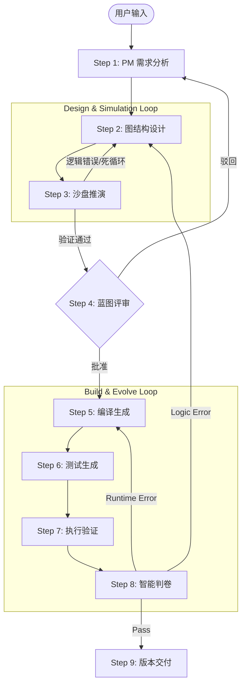

# AgentFactory 编排器实施计划 (v2.0)

**创建时间**: 2026-01-15  
**版本**: v2.0 - 仿真与进化闭环版  
**优先级**: Phase 5 (Phase 4 完成后)

---

## 📋 背景和动机

### 当前问题

1.  **用户使用流程过于复杂**: 用户需手动协调多个模块 (PM -> Designer -> Compiler -> TestGen)。
2.  **安全性缺失**: 代码生成前没有预演机制，逻辑错误只能在运行时发现。
3.  **缺乏自愈能力**: Phase 4 已经具备了错误分类能力，但目前还需要人工介入修复。

### 目标

创建 `AgentFactory` 编排器,实现:
1.  **一键生成**: 统一入口 `create_agent`。
2.  **仿真推演**: 在编译前通过 **Simulator** 验证图结构，拦截逻辑设计错误。
3.  **闭环进化**: 集成 **Judge** 反馈，实现 Runtime Error 自动重编译，Logic Error 自动重设计。
4.  **人机协作**: 支持 "蓝图评审" (Blueprint Review)，让用户在关键节点介入。

---

## 🎯 核心设计

### 架构图



### 核心类设计

#### 1. AgentFactory (主编排器)

```python
class AgentFactory:
    """Agent 工厂 - 智能体构建流水线"""
    
    def __init__(self, builder_client: BuilderClient):
        self.pm = PM(builder_client)
        self.designer = GraphDesigner(builder_client)
        self.simulator = Simulator(builder_client)
        self.compiler = Compiler(...)
        self.test_gen = TestGenerator(builder_client)
        self.judge = Judge()
        
    async def create_agent(
        self,
        user_input: str,
        interactive: bool = True
    ) -> AgentResult:
        """
        全流程构建 Agent
        
        流程:
        1. PM 分析需求 (处理澄清)
        2. LOOP: 设计 <-> 仿真 (自动修复逻辑错误)
        3. IF interactive: 等待用户批准蓝图
        4. LOOP: 编译 -> 测试 -> 修复 (自动修复运行时错误)
        5. Git 交付
        """
```

#### 2. AgentResult (结果对象)

```python
class AgentResult(BaseModel):
    """构建结果"""
    agent_dir: Path
    
    # 过程数据
    project_meta: ProjectMeta
    graph: GraphStructure
    simulation_result: SimulationResult  # 新增: 仿真结果
    
    # 结果状态
    success: bool
    judge_feedback: Optional[JudgeResult]
    git_version: str
```

---

## 📝 详细实施步骤

### Step 1: 核心框架与状态管理

**目标**: 建立能够维持跨阶段状态的工厂类。

*   实现 `AgentFactory` 类。
*   定义 `FactoryContext` 用于在步骤间传递数据 (meta, graph, config 等)。

### Step 2: 集成仿真循环 (Simulation Loop)

**目标**: 恢复被遗漏的 Phase 3 核心功能 —— 沙盘推演。

*   **逻辑**:
    ```python
    async def _design_and_simulate(self, meta: ProjectMeta) -> GraphStructure:
        for attempt in range(3):
            graph = await self.designer.design(meta)
            sim_result = await self.simulator.simulate(graph)
            
            if sim_result.has_critical_issues():
                # 将仿真日志作为反馈传回 Designer
                await self.designer.refine_design(graph, sim_result.issues)
                continue
            
            return graph
    ```

### Step 3: 蓝图评审接口 (Blueprint Review)

**目标**: 让用户有机会在生成代码前介入。

*   如果不启用交互模式 (interactive=False)，则自动跳过。
*   启用时，展示：
    1.  Agent 架构图 (Mermaid)
    2.  仿真推演日志 (模拟的对话流程)
*   用户操作: 批准 / 修改需求 / 重新生成。

### Step 4: 集成闭环进化 (Build & Evolve)

**目标**: 利用 Phase 4 的 Judge 能力实现自我修复。

*   **逻辑**:
    ```python
    async def _build_and_evolve(self, meta, graph) -> AgentResult:
        current_graph = graph
        
        for iteration in range(3):
            # 1. Compile & Init Env
            self.compiler.compile(...)
            
            # 2. Gen Test & Run
            tests = await self.test_gen.generate(...)
            results = self.runner.run_tests(...)
            
            # 3. Judge
            verdict = self.judge.analyze(results)
            
            if verdict.is_pass:
                break
                
            # 4. Fix Strategy
            if verdict.target == "COMPILER":
                # 修复代码/环境 (通常是重写 prompt 或依赖)
                self.compiler.apply_fix(verdict.feedback)
            elif verdict.target == "GRAPH_DESIGNER":
                # 致命逻辑错误，需回退到设计阶段 (成本高)
                current_graph = await self.designer.fix_logic(current_graph, verdict.feedback)
    ```

---

## 📅 实施时间表

| 阶段 | 任务 | 预计耗时 |
| :--- | :--- | :--- |
| **Phase 5.1** | **核心框架** (AgentFactory类, 状态管理) | 1 天 |
| **Phase 5.2** | **仿真集成** (Simulator调用, 自动重设计逻辑) | 1 天 |
| **Phase 5.3** | **进化闭环** (Runner/Judge集成, 自动修复逻辑) | 1-2 天 |
| **Phase 5.4** | **交互接口** (Blueprint Review 回调机制) | 1 天 |
| **Phase 5.5** | **测试验证** (E2E 自愈能力测试) | 1-2 天 |

**总计**: 5-7 天

---

## ✅ 验收标准

1.  **仿真拦截率**: 能够通过 Simulator 拦截并自动修复所有的 "死循环" 和 "不可达节点" 错误。
2.  **自愈能力**:
    *   对于简单的 SyntaxError 或 ImportError，在 1 次迭代内自动修复。
    *   对于 DeepEval 的逻辑测试失败，能生成有效的修复建议并尝试重编译。
3.  **零代码生成体验**: 用户在不写一行代码的情况下，获得一个 Git 管理的、通过测试的 Agent 项目。
