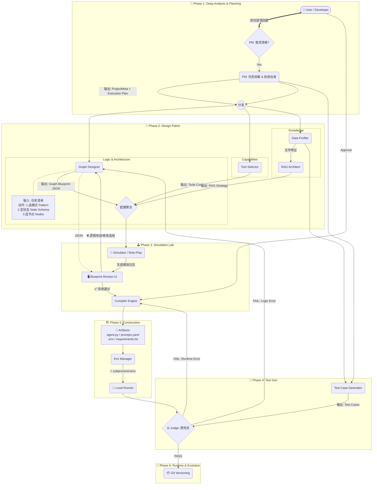

目前的 `Node: PM` 和 `Graph_Designer` 本质上是一个**“单次通过的翻译器”**（Linear Translator）。对于“写个贪吃蛇”这种复杂任务，单纯靠一次性生成的 JSON 往往不够健壮，不仅无法处理复杂的循环/分支，而且一旦生成了错误的 Python 代码，调试成本极高。

结合 **LangGraph** 的最新特性和 **Agentic Design Patterns**，我对这两个核心节点提出以下**深度改造建议**。这不仅仅是修改 Prompt，而是引入**“状态机思维”**和**“仿真层”**。

---

### 🚀 改造核心理念：从“线性生成”转向“蓝图仿真”

不要直接从 `Requirement` 跳到 `Code`。中间必须加一层**“蓝图仿真 (Blueprint Simulation)”**。

#### 新的架构流向：
`User Input` -> **`PM (咨询与拆解)`** -> `Plan` -> **`Designer (状态与模式)`** -> `Graph Blueprint (JSON)` -> **`Simulator (文本推演)`** -> `User Approval` -> `Compiler` -> `Code`


**核心变化点**：
1.  **PM 升级为双脑模式**：拆分为“澄清者 (Clarifier)”和“架构师 (Planner)”，增加了与用户的交互回路。
2.  **新增沙盘推演层 (Simulation Lab)**：在写代码前，先进行逻辑仿真，这是防止架构崩塌的关键防火墙。
3.  **图设计师增强**：明确了“模式选择 (Pattern)”和“状态定义 (State)”的职责。
4.  **人机协同 (HITL)**：在编译前增加了“蓝图验收”环节。



---

### 🌟 图解新特性详解

#### 1. 🔄 PM Clarifier (澄清回路)
*   **位置**：Phase 1 的入口。
*   **作用**：不再是“一言堂”。如果用户说“帮我写个爬虫”，PM 会被挡在 `PM_Clarifier`，必须反问“爬哪个网站？数据存哪？”，直到需求清晰度达标才放行到 `PM_Planner`。

#### 2. 🎨 Logic Stream 的深度 (Graph Designer)
*   **变化**：注意 `Graph_Designer` 旁边的注释节点。
*   **流程**：现在它是先选 **Pattern** (如 Supervisor/Reflection)，再定义 **State Schema** (数据结构)，最后才是画 **Nodes**。这是 LangGraph 能够稳定运行复杂任务的基石。

#### 3. 🕹️ Phase 3: Simulation Lab (沙盘推演)
*   **这是最大的防线**。
*   **Merger**：把图结构、工具、RAG 配置聚合在一起。
*   **Simulator**：一个不写代码、不调 API 的 LLM，纯文字扮演整个流程（"我是 Agent，我现在决定调用搜索工具..."）。
*   **Blueprint Review UI**：用户在这里看推演日志。如果发现 Agent 在死循环，直接把线拖开（修改 JSON），此时还**没有生成一行代码**，修改成本极低。

#### 4. ⚖️ Judge 的双重反馈 (Dual Feedback)
*   注意 Phase 6 的 `Judge` 有两条红色的反馈线：
    *   **FAIL: Runtime Error** (如缺少依赖、语法错误) -> 回滚给 **Compiler** 修正代码。
    *   **FAIL: Logic Error** (如答案一直不对、死循环) -> 回滚给 **Graph_Designer** 修改图结构或 Prompt。


---

### 1. 改造 Node: PM (需求分析师) —— 引入“咨询回路”与“任务拆解”

目前的 PM 主要是提取 Meta 信息。升级后的 PM 应该像一个真正的产品经理，具备**拒绝**和**拆解**的能力。

#### A. 新增功能：Clarification Loop (澄清回路)
在生成方案前，如果信息不足，PM 应暂停并反问，而不是瞎猜。
*   **逻辑**：
    1.  接收用户输入。
    2.  Check: 信息完整度 < 80% ?
    3.  True -> 生成 2-3 个关键反问句（"需要联网吗？", "输出格式是 Markdown 还是 PDF？"）。
    4.  False -> 进入下一步。
*   **实现**：在 `project_meta.json` 中增加 `status: "clarifying" | "ready"` 字段。

#### B. 新增功能：Hierarchical Planning (分层规划)
面对复杂任务（如“写游戏”），PM 不应直接生成 Graph，而是先生成**自然语言的任务清单**。
*   **输出升级**：
    在 `project_meta.json` 中增加 `execution_plan` 字段：
    ```json
    "execution_plan": [
      {"step": 1, "role": "Architect", "goal": "设计游戏核心类结构"},
      {"step": 2, "role": "Coder", "goal": "实现 Pygame 主循环"},
      {"step": 3, "role": "Tester", "goal": "运行并修复报错"},
      {"step": 4, "role": "Packager", "goal": "保存为 .exe"}
    ]
    ```
    *这直接指导了 Designer 需要设计什么样的节点。*

---

### 2. 改造 Node: Graph_Designer (图设计师) —— 引入“State”和“Pattern”

这是 LangGraph 的灵魂。简单的节点连接不足以支撑复杂逻辑，必须引入**状态定义**和**设计模式**。

#### A. 核心升级：State Schema Definition (状态定义)
LangGraph 的核心是 `State`。Designer 必须明确定义**“节点之间传什么数据”**。
*   **输出升级**：在 `graph_structure.json` 中增加 `state_schema`：
    ```json
    "state_schema": {
      "messages": "List[BaseMessage]", // 基础记忆
      "code_draft": "str",             // 代码草稿
      "review_comments": "str",        // 审核意见
      "retry_count": "int",            // 循环控制变量
      "is_finished": "bool"            // 终止条件
    }
    ```
    *Compiler 将根据这个字段生成 Python 的 `TypedDict` 定义。*

#### B. 核心升级：Pattern Selection (模式选择)
不要让 LLM 每次都从零画图。预置几种经典的 Agent 模式，Designer 做的是**“选型 + 微调”**。
*   **支持模式库**：
    1.  **Sequential (顺序模式)**: `A -> B -> C` (简单任务)
    2.  **Reflection (反思模式)**: `Generate <-> Critique` (写作/编程)
    3.  **Supervisor (主管模式)**: `Manager -> [Worker1, Worker2] -> Manager` (多工具协作)
    4.  **Plan-and-Execute (规划执行模式)**: `Planner -> Executor -> Replanner` (长流程任务)

#### C. 解决“循环与条件”：Explicit Logic Blocks
在 JSON 中显式定义条件逻辑，而不是只画线。
*   **输出升级**：在 `graph_structure.json` 的 `conditional_edges` 中引入逻辑表达式：
    ```json
    "conditional_edges": [
      {
        "source": "reviewer",
        "condition_logic": "if retry_count < 3 and 'error' in review_comments: return 'coder'; else: return 'end'",
        "branches": {"coder": "coder_node", "end": "END"}
      }
    ]
    ```
    *Compiler 会将这段伪代码翻译成 Python 的 `def decide_next_step(state):` 函数。*

---

### 3. 新增 Node: Simulator (沙盘推演) —— 低成本试错

这是解决“一开始架构就是错的”的最有效手段。**在生成任何代码之前，先跑一遍文字模组。**

*   **输入**：`graph_structure.json` + `user_input`
*   **逻辑**：
    LLM 扮演 Simulator 角色，读取图结构，一步步模拟运行：
    > "我是 Simulator。当前进入 'Coder' 节点。模拟生成了代码... 状态更新：code_draft='import...'。进入 'Reviewer' 节点。模拟发现 Bug... 触发条件 retry_count < 3。决定跳回 'Coder' 节点。"
*   **输出**：`simulation_log.txt`
*   **交互**：用户在 UI 上看到这个推演过程。如果发现逻辑死循环，用户直接修改图结构（JSON），而不是改代码。

---

### 4. 实施建议 (基于 Phase 2 完成情况)

你已经完成了工具和RAG，现在的 `Graph_Designer` 应该能利用这些资产。

#### 修改建议清单：

1.  **修改 `src/schemas/graph.py` (Pydantic Model)**:
    *   增加 `StateSchema` 类 (定义字段名和类型)。
    *   增加 `PatternType` 枚举 (Reflection, Supervisor, etc.)。
    *   在 `NodeConfig` 中增加 `role_description` (用于 Prompt 生成)。

2.  **修改 `src/core/graph_designer.py`**:
    *   Prompt 策略变更：先选 Pattern，再填充 Nodes。
    *   强制 LLM 在设计循环时，必须在 State 中添加 `counter` 变量，防止死循环。

3.  **修改 `src/templates/agent_template.py.j2`**:
    *   这是大工程。需要支持动态渲染 `TypedDict` State。
    *   需要支持渲染 Conditional Edge 的逻辑函数（不仅仅是映射字典）。

4.  **UI 交互层 (Human-in-the-Loop)**:
    *   在 Compiler 运行前，增加一个 **"Blueprint Review"** 步骤。
    *   展示可视化图谱（可以用 Mermaid.js 渲染 `graph_structure.json`）。
    *   允许用户手动调整 JSON（比如修改 Prompt，或者增加 retry 次数）。

### 总结

目前的“简单”是因为**把 Agent 当作了 Prompt Engineering**（写个好提示词就行）。
升级后的 Agent Zero v6.0 应该**把 Agent 当作 Software Engineering**（有需求文档、有架构图、有状态管理、有预演）。

**下一步推荐行动**：
优先改造 `Graph Designer`，引入 **State Definition**。这是支持复杂循环和条件判断的基石。没有 State，LangGraph 只是一个复杂的 Chain。