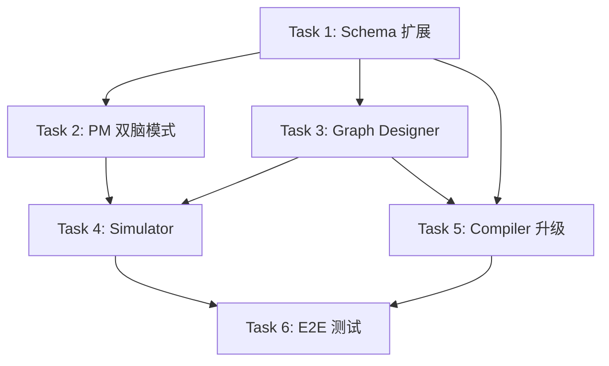

# Agent Zero v6.0 - 阶段三修改实施计划

> **基于当前进度**: Phase 1 ✅ Phase 2 ✅ → Phase 3 开始  
> **创建日期**: 2026-01-14  
> **目标**: 实现蓝图仿真系统 (PM双脑模式 + Graph Designer三步法 + Simulator)

---

## 📋 当前完成状态

### 已完成模块 (Phase 1 & 2)

| 模块 | 文件 | 状态 | 说明 |
|------|------|------|------|
| Compiler | `src/core/compiler.py` | ✅ | 基础代码生成 |
| EnvManager | `src/core/env_manager.py` | ✅ | venv 管理 |
| BuilderClient | `src/llm/builder_client.py` | ✅ | 构建时 LLM |
| RuntimeClient | `src/llm/runtime_client.py` | ✅ | 运行时配置 |
| Profiler | `src/core/profiler.py` | ✅ | 文档分析 |
| RAG Builder | `src/core/rag_builder.py` | ✅ | RAG 策略 |
| Tool Registry | `src/tools/registry.py` | ✅ | 工具注册 |
| Tool Selector | `src/core/tool_selector.py` | ✅ | 工具选择 |
| PM | `src/core/pm.py` | ✅ 基础版 | 需升级 |
| Graph Designer | `src/core/graph_designer.py` | ✅ 基础版 | 需升级 |
| Schemas | `src/schemas/*.py` | ✅ 基础版 | 需扩展 |

### 需要新增/修改的模块

| 模块 | 文件 | 类型 | 优先级 |
|------|------|------|--------|
| StateSchema | `src/schemas/state_schema.py` | 新增 | ⭐⭐⭐ |
| PatternConfig | `src/schemas/pattern.py` | 新增 | ⭐⭐⭐ |
| SimulationResult | `src/schemas/simulation.py` | 新增 | ⭐⭐⭐ |
| ProjectMeta | `src/schemas/project_meta.py` | 修改 | ⭐⭐⭐ |
| GraphStructure | `src/schemas/graph_structure.py` | 修改 | ⭐⭐⭐ |
| PM | `src/core/pm.py` | 重构 | ⭐⭐⭐ |
| Graph Designer | `src/core/graph_designer.py` | 重构 | ⭐⭐⭐ |
| Simulator | `src/core/simulator.py` | 新增 | ⭐⭐⭐ |
| Compiler | `src/core/compiler.py` | 修改 | ⭐⭐ |
| Templates | `src/templates/*.j2` | 修改 | ⭐⭐ |

---

## 🗓️ 详细实施计划 (2周)

### Week 1: Schema层 + PM升级

#### Day 1-2: Schema 层扩展

##### Task 1.1: 新增 PatternConfig 模型
**文件**: `src/schemas/pattern.py`

```python
# 实现内容
class PatternType(str, Enum):
    SEQUENTIAL = "sequential"
    REFLECTION = "reflection"
    SUPERVISOR = "supervisor"
    PLAN_EXECUTE = "plan_execute"
    CUSTOM = "custom"

class PatternConfig(BaseModel):
    pattern_type: PatternType
    max_iterations: int = Field(default=3, ge=1, le=10)
    termination_condition: Optional[str] = None
    description: str = ""
```

**验证**: 单元测试 `tests/unit/test_pattern.py`

---

##### Task 1.2: 新增 StateSchema 模型
**文件**: `src/schemas/state_schema.py`

```python
# 实现内容
class StateFieldType(str, Enum):
    STRING = "str"
    INT = "int"
    BOOL = "bool"
    LIST_MESSAGE = "List[BaseMessage]"
    # ...

class StateField(BaseModel):
    name: str
    type: StateFieldType
    description: Optional[str] = None
    default: Optional[Any] = None
    reducer: Optional[str] = None

class StateSchema(BaseModel):
    fields: List[StateField]
```

**验证**: 单元测试 `tests/unit/test_state_schema.py`

---

##### Task 1.3: 新增 SimulationResult 模型
**文件**: `src/schemas/simulation.py`

```python
# 实现内容
class SimulationStep(BaseModel):
    step_number: int
    step_type: SimulationStepType
    node_id: Optional[str]
    description: str
    state_snapshot: Optional[Dict]

class SimulationIssue(BaseModel):
    issue_type: Literal["infinite_loop", "unreachable_node", ...]
    severity: Literal["error", "warning"]
    description: str
    affected_nodes: List[str]

class SimulationResult(BaseModel):
    success: bool
    total_steps: int
    steps: List[SimulationStep]
    issues: List[SimulationIssue]
    execution_trace: str
    mermaid_trace: Optional[str]
```

**验证**: 单元测试 `tests/unit/test_simulation.py`

---

##### Task 1.4: 修改 ProjectMeta 模型
**文件**: `src/schemas/project_meta.py`

**新增字段**:
```python
# 在现有 ProjectMeta 中添加
status: Literal["clarifying", "ready"] = Field(default="ready")
complexity_score: int = Field(default=1, ge=1, le=10)
execution_plan: Optional[List[ExecutionStep]] = None
```

**验证**: 更新现有测试

---

##### Task 1.5: 修改 GraphStructure 模型
**文件**: `src/schemas/graph_structure.py`

**修改内容**:
```python
# 在 ConditionalEdgeDef 中添加
condition_logic: Optional[str] = Field(None, description="条件逻辑表达式")

# 在 GraphStructure 中添加
pattern: PatternConfig = Field(...)
state_schema: StateSchema = Field(...)
```

**验证**: 更新现有测试

---

##### Task 1.6: 更新 Schema __init__.py
**文件**: `src/schemas/__init__.py`

导出所有新增模型

---

#### Day 3-4: PM 双脑模式实现

##### Task 2.1: 设计 PM Prompt 模板
**新增文件**: 
- `src/prompts/pm_clarifier.txt`
- `src/prompts/pm_planner.txt`

**PM Clarifier Prompt 要点**:
- 评估信息完整度 (0-100%)
- 识别缺失信息类型
- 生成最多3个聚焦的澄清问题

**PM Planner Prompt 要点**:
- 分析任务复杂度
- 生成角色分工 (Architect/Coder/Tester/...)
- 输出结构化执行计划

---

##### Task 2.2: 实现 PM Clarifier
**修改文件**: `src/core/pm.py`

```python
async def clarify_requirements(
    self, 
    user_query: str,
    chat_history: List[Dict]
) -> Tuple[bool, Optional[List[str]]]:
    """
    返回: (is_ready, clarification_questions)
    
    实现逻辑:
    1. 调用 LLM 评估完整度
    2. 如果 < 80%, 生成澄清问题
    3. 返回结果
    """
    pass
```

---

##### Task 2.3: 实现 PM Planner
**修改文件**: `src/core/pm.py`

```python
async def create_execution_plan(
    self,
    project_meta: ProjectMeta
) -> List[ExecutionStep]:
    """
    实现逻辑:
    1. 分析任务复杂度
    2. 确定需要的角色
    3. 生成步骤清单
    """
    pass

async def estimate_complexity(
    self,
    user_query: str,
    has_files: bool
) -> int:
    """评估任务复杂度 1-10"""
    pass
```

---

##### Task 2.4: 整合双脑模式流程
**修改文件**: `src/core/pm.py`

```python
async def analyze_with_clarification_loop(
    self,
    user_query: str,
    chat_history: List[Dict],
    file_paths: Optional[List[str]] = None
) -> ProjectMeta:
    """完整的双脑模式分析"""
    pass
```

**验证**: 
- 单元测试 `tests/unit/test_pm_v2.py`
- 手动测试: 模糊需求应返回 status="clarifying"

---

#### Day 5: PM 测试与文档

##### Task 2.5: 编写 PM 单元测试
**文件**: `tests/unit/test_pm_v2.py`

测试用例:
- `test_clarify_vague_requirements` - 模糊需求应触发澄清
- `test_clarify_clear_requirements` - 清晰需求应直接通过
- `test_create_execution_plan_simple` - 简单任务的计划
- `test_create_execution_plan_complex` - 复杂任务的计划
- `test_estimate_complexity` - 复杂度评估

---

### Week 2: Graph Designer升级 + Simulator

#### Day 6-7: Graph Designer 三步设计法

##### Task 3.1: 创建模式模板库
**新增目录**: `config/patterns/`

**新增文件**:
- `config/patterns/sequential.yaml`
- `config/patterns/reflection.yaml`
- `config/patterns/supervisor.yaml`
- `config/patterns/plan_execute.yaml`

**模板格式**:
```yaml
name: reflection
description: "生成-批评循环模式"
default_nodes:
  - id: generator
    type: llm
    role_description: "生成内容"
  - id: critic
    type: llm
    role_description: "评审内容"
default_edges:
  - source: generator
    target: critic
default_conditional_edges:
  - source: critic
    condition: should_continue
    condition_logic: |
      if state["iteration_count"] < 3 and "improve" in state["feedback"]:
          return "generator"
      return "end"
    branches:
      generator: generator
      end: END
required_state_fields:
  - name: draft
    type: str
  - name: feedback
    type: str
  - name: iteration_count
    type: int
```

---

##### Task 3.2: 实现 Pattern Selector
**修改文件**: `src/core/graph_designer.py`

```python
def _load_pattern_templates(self) -> Dict[PatternType, Dict]:
    """加载 YAML 模式模板"""
    pass

async def select_pattern(
    self,
    project_meta: ProjectMeta
) -> PatternConfig:
    """
    选择设计模式
    
    决策规则:
    - 有 execution_plan 且步骤 > 3 -> Plan-Execute
    - 包含"审核"/"修改"/"迭代" -> Reflection
    - 包含多角色协作 -> Supervisor
    - 其他 -> Sequential
    """
    pass
```

---

##### Task 3.3: 实现 State Schema Generator
**修改文件**: `src/core/graph_designer.py`

```python
async def define_state_schema(
    self,
    project_meta: ProjectMeta,
    pattern: PatternConfig
) -> StateSchema:
    """
    定义状态结构
    
    必须包含:
    - messages (对话历史)
    - 模式所需字段 (从模板读取)
    - 循环控制变量
    """
    pass
```

---

##### Task 3.4: 升级 Nodes & Edges 设计
**修改文件**: `src/core/graph_designer.py`

```python
async def design_nodes_and_edges(
    self,
    project_meta: ProjectMeta,
    pattern: PatternConfig,
    state_schema: StateSchema,
    tools_config: Optional[ToolsConfig] = None,
    rag_config: Optional[RAGConfig] = None
) -> GraphStructure:
    """
    设计节点和边
    
    流程:
    1. 从模式模板加载基础结构
    2. 根据 tools_config 添加工具节点
    3. 根据 rag_config 添加 RAG 节点
    4. 生成 condition_logic 表达式
    """
    pass
```

---

##### Task 3.5: 编写 Graph Designer 测试
**文件**: `tests/unit/test_graph_designer_v2.py`

测试用例:
- `test_select_pattern_sequential`
- `test_select_pattern_reflection`
- `test_define_state_schema`
- `test_design_nodes_with_tools`
- `test_design_nodes_with_rag`
- `test_condition_logic_generation`

---

#### Day 8-9: Simulator 实现

##### Task 4.1: 设计 Simulator Prompt
**新增文件**: `src/prompts/simulator.txt`

**Prompt 要点**:
- 角色: 模拟执行器
- 输入: 图结构 + 初始状态 + 用户输入
- 输出: 每步的节点、动作、状态变化
- 约束: 不执行代码，纯文本推演

---

##### Task 4.2: 实现 Simulator 核心逻辑
**新增文件**: `src/core/simulator.py`

```python
class Simulator:
    def __init__(self, llm_client: BuilderClient):
        self.llm = llm_client
    
    async def simulate(
        self,
        graph: GraphStructure,
        sample_input: str,
        max_steps: int = 20
    ) -> SimulationResult:
        """
        主仿真流程:
        1. 初始化状态
        2. 进入 entry_point
        3. 循环:
           - LLM 模拟当前节点
           - 更新状态
           - 评估条件边
           - 决定下一节点
        4. 检查终止条件
        5. 返回结果
        """
        pass
```

---

##### Task 4.3: 实现问题检测
**文件**: `src/core/simulator.py`

```python
def detect_issues(
    self,
    simulation_log: List[SimulationStep],
    graph: GraphStructure
) -> List[SimulationIssue]:
    """
    检测问题:
    - 死循环: 同一节点连续访问 > 5 次
    - 不可达节点: 从未被访问的节点
    - 状态未更新: 节点执行后状态无变化
    """
    pass
```

---

##### Task 4.4: 实现轨迹可视化
**文件**: `src/core/simulator.py`

```python
def generate_mermaid_trace(
    self,
    simulation_log: List[SimulationStep],
    graph: GraphStructure
) -> str:
    """
    生成 Mermaid 格式的执行轨迹
    
    示例输出:
    ```mermaid
    graph LR
        A[generator] -->|1| B[critic]
        B -->|2| A
        A -->|3| B
        B -->|4| C[END]
    ```
    """
    pass

def generate_readable_log(
    self,
    simulation_log: List[SimulationStep]
) -> str:
    """生成可读的文本日志"""
    pass
```

---

##### Task 4.5: 编写 Simulator 测试
**文件**: `tests/unit/test_simulator.py`

测试用例:
- `test_simulate_sequential_graph`
- `test_simulate_reflection_graph`
- `test_detect_infinite_loop`
- `test_detect_unreachable_node`
- `test_generate_mermaid_trace`

---

#### Day 10: Compiler 模板升级

##### Task 5.1: 更新 agent_template.py.j2
**文件**: `src/templates/agent_template.py.j2`

新增渲染:
- TypedDict 状态定义
- 条件函数 (从 condition_logic 生成)
- 角色描述注释

---

##### Task 5.2: 修改 Compiler 逻辑
**文件**: `src/core/compiler.py`

修改:
- 处理 state_schema → TypedDict
- 处理 condition_logic → Python 函数
- 更新 requirements.txt 生成

---

##### Task 5.3: 编写渲染测试
**文件**: `tests/unit/test_compiler_v2.py`

测试:
- TypedDict 渲染正确性
- 条件函数渲染正确性
- 生成代码可执行

---

#### Day 11-12: E2E 测试与集成

##### Task 6.1: E2E 测试 - Sequential 模式
**文件**: `tests/e2e/test_sequential_pattern.py`

完整流程:
1. 输入简单需求
2. PM 分析 (无澄清)
3. Graph Designer 选择 Sequential
4. Simulator 验证
5. Compiler 生成
6. 验证生成代码

---

##### Task 6.2: E2E 测试 - Reflection 模式
**文件**: `tests/e2e/test_reflection_pattern.py`

完整流程:
1. 输入需要迭代的需求
2. PM 生成执行计划
3. Graph Designer 选择 Reflection
4. Simulator 验证循环逻辑
5. Compiler 生成
6. 验证条件函数

---

##### Task 6.3: E2E 测试 - 完整仿真流程
**文件**: `tests/e2e/test_simulation_flow.py`

测试:
1. 用户需求 → PM 澄清回路
2. 澄清后 → PM 规划
3. 规划 → Graph Designer
4. Graph → Simulator 发现问题
5. 修正后重新仿真
6. 验收通过 → Compiler

---

##### Task 6.4: 清理与文档
- 删除旧版 PM/GraphDesigner 的冗余代码
- 更新 README.md
- 更新 phase3_summary.md

---

## 📊 任务依赖图



---

## ✅ 验收标准

| 功能点 | 验收标准 |
|--------|----------|
| PM 澄清 | 输入"帮我写个爬虫"，返回 status="clarifying" + 2-3个问题 |
| PM 规划 | 输入复杂需求，生成 3+ 步骤的 execution_plan |
| 模式选择 | 包含"审核"的需求，选择 Reflection 模式 |
| 状态定义 | 任何循环任务，生成包含 retry_count 的 state_schema |
| 沙盘推演 | 死循环图被检测并报告 |
| 模板渲染 | 生成的代码包含 TypedDict 定义 |
| E2E | 从需求到可执行 Agent 的完整流程 |

---

## 🚀 执行命令

### 开发环境
```bash
# 安装依赖
pip install -r requirements.txt
pip install -r requirements-dev.txt

# 运行单元测试
pytest tests/unit/ -v

# 运行特定测试
pytest tests/unit/test_pm_v2.py -v
pytest tests/unit/test_graph_designer_v2.py -v
pytest tests/unit/test_simulator.py -v

# 运行 E2E 测试
pytest tests/e2e/test_sequential_pattern.py -v
pytest tests/e2e/test_simulation_flow.py -v
```

### 手动测试
```bash
# 启动交互式测试
python start.py

# 测试 PM 澄清
# 输入: "帮我写个爬虫"
# 预期: 返回澄清问题
```

---

> [!IMPORTANT]
> **关键路径**: Schema 扩展 → PM 升级 → Graph Designer → Simulator → Compiler → E2E
> 
> 如果时间紧张，可优先实现 **启发式模式** (不依赖 LLM)，后续再切换到 LLM 模式。

