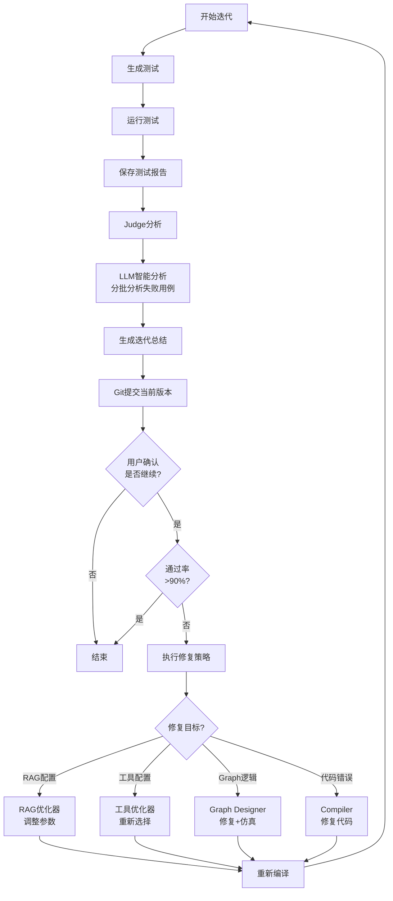

# Agent Zero Phase 6: Runtime & Evolution - 详细实施计划

## 🎯 阶段目标

实现完整的**测试-分析-修复-迭代闭环**,支持智能化的Agent自我进化,包括:
1. 全面的错误分类和修复路由 (Compiler/Graph/RAG/Tools)
2. 基于LLM的智能测试分析和修复策略生成
3. 用户交互式迭代确认机制
4. 完整的版本管理和迭代历史追踪

---

## 📋 任务清单

### Task 6.1: 增强 Judge 分析能力 ⭐⭐⭐⭐⭐

**目标**: 扩展 Judge 支持 RAG/Tools 配置问题的识别

#### 6.1.1 扩展错误分类
**文件**: `src/schemas/judge_result.py`

**新增错误类型**:
```python
class ErrorType(str, Enum):
    NONE = "none"
    RUNTIME = "runtime"          # 现有
    LOGIC = "logic"              # 现有
    TIMEOUT = "timeout"          # 现有
    API = "api"                  # 现有
    RAG_QUALITY = "rag_quality"  # 🆕 RAG检索质量问题
    RAG_CONFIG = "rag_config"    # 🆕 RAG配置问题
    TOOL_ERROR = "tool_error"    # 🆕 工具调用错误
    TOOL_CONFIG = "tool_config"  # 🆕 工具配置问题
```

**新增修复目标**:
```python
class FixTarget(str, Enum):
    MANUAL = "manual"
    COMPILER = "compiler"        # 现有
    GRAPH_DESIGNER = "graph_designer"  # 现有
    RAG_BUILDER = "rag_builder"  # 🆕 RAG配置优化
    TOOL_SELECTOR = "tool_selector"  # 🆕 工具选择优化
    HYBRID = "hybrid"            # 🆕 需要多个组件协同修复
```

#### 6.1.2 智能错误分类逻辑
**文件**: `src/core/judge.py`

**新增方法**:
```python
def _classify_rag_error(self, result: ExecutionResult) -> ErrorType:
    """识别RAG相关错误
    
    检查指标:
    - Contextual Recall < 0.5 → RAG_QUALITY (检索不到相关文档)
    - Faithfulness < 0.5 → RAG_QUALITY (检索到错误文档)
    - 多个测试都失败在检索阶段 → RAG_CONFIG (配置问题)
    """
    
def _classify_tool_error(self, result: ExecutionResult) -> ErrorType:
    """识别工具相关错误
    
    检查:
    - 工具调用失败 → TOOL_ERROR
    - 工具选择不当 → TOOL_CONFIG
    """
```

---

### Task 6.2: 测试报告管理系统 ⭐⭐⭐⭐

**目标**: 持久化测试结果,支持历史对比和趋势分析

#### 6.2.1 测试报告Schema
**文件**: `src/schemas/test_report.py` (新建)

```python
from pydantic import BaseModel, Field
from datetime import datetime
from typing import List, Dict, Any, Optional

class TestCaseReport(BaseModel):
    """单个测试用例报告"""
    test_id: str
    test_name: str
    status: str  # PASSED, FAILED, SKIPPED
    metrics: Dict[str, float]  # {"faithfulness": 0.8, "recall": 0.6}
    actual_output: str
    expected_output: str
    retrieval_context: List[str]
    error_message: Optional[str] = None
    duration_seconds: float

class IterationReport(BaseModel):
    """单次迭代报告"""
    iteration_id: int
    timestamp: datetime
    agent_name: str
    
    # 测试结果
    total_tests: int
    passed_tests: int
    failed_tests: int
    pass_rate: float
    
    test_cases: List[TestCaseReport]
    
    # Judge分析
    error_types: Dict[ErrorType, int]  # 错误类型统计
    fix_target: FixTarget
    judge_feedback: str
    
    # 配置快照
    graph_snapshot: Dict[str, Any]
    rag_config_snapshot: Optional[Dict[str, Any]]
    tools_config_snapshot: Optional[Dict[str, Any]]
    
    # Git信息
    git_commit_hash: Optional[str]
    git_commit_message: Optional[str]

class AgentEvolutionHistory(BaseModel):
    """Agent进化历史"""
    agent_name: str
    created_at: datetime
    iterations: List[IterationReport]
    
    def get_trend(self) -> Dict[str, List[float]]:
        """获取指标趋势"""
        return {
            "pass_rate": [it.pass_rate for it in self.iterations],
            "avg_faithfulness": [...],
            "avg_recall": [...]
        }
```

#### 6.2.2 报告管理器
**文件**: `src/core/report_manager.py` (新建)

```python
class ReportManager:
    """测试报告管理器"""
    
    def __init__(self, agent_dir: Path):
        self.agent_dir = agent_dir
        self.reports_dir = agent_dir / ".reports"
        self.reports_dir.mkdir(exist_ok=True)
    
    def save_iteration_report(self, report: IterationReport):
        """保存迭代报告"""
        filename = f"iteration_{report.iteration_id}_{report.timestamp.strftime('%Y%m%d_%H%M%S')}.json"
        filepath = self.reports_dir / filename
        
        with open(filepath, 'w', encoding='utf-8') as f:
            json.dump(report.model_dump(), f, indent=2, ensure_ascii=False)
    
    def load_history(self) -> AgentEvolutionHistory:
        """加载完整历史"""
        # 读取所有报告文件
        # 按时间排序
        # 构建AgentEvolutionHistory
    
    def generate_summary(self, iteration_id: int) -> str:
        """生成迭代总结"""
        report = self.load_iteration_report(iteration_id)
        
        summary = f"""
        📊 迭代 {iteration_id} 总结
        ==========================================
        
        🧪 测试结果:
           - 总测试数: {report.total_tests}
           - 通过: {report.passed_tests} ✅
           - 失败: {report.failed_tests} ❌
           - 通过率: {report.pass_rate:.1%}
        
        🔍 错误分析:
           {self._format_error_types(report.error_types)}
        
        🎯 修复目标: {report.fix_target}
        
        💡 Judge反馈:
           {report.judge_feedback}
        
        📦 Git提交: {report.git_commit_hash}
        ==========================================
        """
        return summary
```

---

### Task 6.3: LLM智能分析器 ⭐⭐⭐⭐⭐

**目标**: 使用LLM分析测试报告,生成精准的修复策略

#### 6.3.1 测试分析器
**文件**: `src/core/test_analyzer.py` (新建)

```python
class TestAnalyzer:
    """基于LLM的测试分析器"""
    
    def __init__(self, llm_client: BuilderClient):
        self.llm = llm_client
    
    async def analyze_test_report(
        self,
        report: IterationReport,
        current_config: Dict[str, Any]
    ) -> AnalysisResult:
        """分析单次迭代的测试报告
        
        策略:
        1. 如果测试用例很多(>10),分批分析
        2. 每批分析1-3个失败的测试用例
        3. 最后汇总所有分析结果
        """
        
        # 1. 分批分析失败的测试用例
        failed_cases = [tc for tc in report.test_cases if tc.status == "FAILED"]
        
        batch_analyses = []
        for batch in self._batch_test_cases(failed_cases, batch_size=3):
            analysis = await self._analyze_batch(batch, current_config)
            batch_analyses.append(analysis)
        
        # 2. 汇总分析
        final_analysis = await self._aggregate_analyses(batch_analyses)
        
        return final_analysis
    
    async def _analyze_batch(
        self,
        test_cases: List[TestCaseReport],
        config: Dict[str, Any]
    ) -> Dict[str, Any]:
        """分析一批测试用例"""
        
        prompt = f"""
        # 测试失败分析任务
        
        ## 当前配置
        ```json
        {json.dumps(config, indent=2, ensure_ascii=False)}
        ```
        
        ## 失败的测试用例
        {self._format_test_cases(test_cases)}
        
        ## 分析要求
        请分析这些测试失败的根本原因,并给出修复建议:
        
        1. **错误类型判断**:
           - RAG检索质量问题? (Recall低)
           - RAG配置问题? (chunk_size, k值)
           - Graph逻辑问题? (节点缺失,路由错误)
           - 工具配置问题?
        
        2. **修复建议**:
           - 需要修改哪些配置参数?
           - 需要调整Graph结构吗?
           - 需要重新选择工具吗?
        
        3. **优先级**:
           - 哪些问题最紧急?
           - 哪些修复最有效?
        
        请以JSON格式返回:
        {{
          "error_type": "rag_quality|rag_config|logic|tool_config",
          "root_cause": "详细的根因分析",
          "fix_suggestions": [
            {{
              "target": "rag_builder|graph_designer|tool_selector",
              "action": "具体的修复动作",
              "parameters": {{"key": "value"}},
              "priority": "high|medium|low"
            }}
          ]
        }}
        """
        
        response = await self.llm.call(prompt)
        return self._parse_analysis_response(response)
    
    async def _aggregate_analyses(
        self,
        batch_analyses: List[Dict[str, Any]]
    ) -> AnalysisResult:
        """汇总多批分析结果"""
        
        prompt = f"""
        # 测试分析汇总任务
        
        以下是对多批测试用例的分析结果:
        
        {json.dumps(batch_analyses, indent=2, ensure_ascii=False)}
        
        请汇总这些分析,给出最终的修复策略:
        
        1. 主要问题是什么?
        2. 推荐的修复顺序?
        3. 预期的改进效果?
        
        返回JSON格式:
        {{
          "primary_issue": "主要问题描述",
          "fix_strategy": [
            {{
              "step": 1,
              "target": "修复目标",
              "action": "修复动作",
              "expected_improvement": "预期改进"
            }}
          ],
          "estimated_success_rate": 0.8
        }}
        """
        
        response = await self.llm.call(prompt)
        return AnalysisResult.parse_obj(json.loads(response))
```

---

### Task 6.4: 用户交互式迭代 ⭐⭐⭐⭐

**目标**: 在每次迭代后询问用户是否继续,展示分析结果

#### 6.4.1 迭代确认回调
**文件**: `src/core/progress_callback.py`

**新增方法**:
```python
class ProgressCallback:
    # ... 现有方法 ...
    
    def on_iteration_complete(
        self,
        iteration_report: IterationReport,
        analysis: AnalysisResult
    ) -> tuple[bool, Optional[str]]:
        """迭代完成回调
        
        Returns:
            (continue, user_feedback)
            - continue: 是否继续迭代
            - user_feedback: 用户额外的反馈
        """
        raise NotImplementedError
```

#### 6.4.2 CLI实现
**文件**: `src/cli/cli_callback.py`

```python
def on_iteration_complete(
    self,
    iteration_report: IterationReport,
    analysis: AnalysisResult
) -> tuple[bool, Optional[str]]:
    """CLI迭代确认"""
    
    print("\n" + "="*60)
    print(f"📊 迭代 {iteration_report.iteration_id} 完成")
    print("="*60)
    
    # 1. 显示测试结果
    print(f"\n🧪 测试结果:")
    print(f"   通过率: {iteration_report.pass_rate:.1%}")
    print(f"   通过: {iteration_report.passed_tests}/{iteration_report.total_tests}")
    
    # 2. 显示失败的测试
    if iteration_report.failed_tests > 0:
        print(f"\n❌ 失败的测试:")
        for tc in iteration_report.test_cases:
            if tc.status == "FAILED":
                print(f"   - {tc.test_name}")
                print(f"     原因: {tc.error_message[:100]}...")
    
    # 3. 显示LLM分析
    print(f"\n🤖 AI分析:")
    print(f"   主要问题: {analysis.primary_issue}")
    print(f"\n💡 修复策略:")
    for i, step in enumerate(analysis.fix_strategy, 1):
        print(f"   {i}. {step.action}")
        print(f"      目标: {step.target}")
        print(f"      预期改进: {step.expected_improvement}")
    
    print(f"\n📈 预计成功率: {analysis.estimated_success_rate:.1%}")
    
    # 4. 询问用户
    print("\n" + "="*60)
    choice = input("是否继续迭代优化? (y/n/feedback): ").strip().lower()
    
    if choice == 'y':
        return True, None
    elif choice == 'n':
        return False, None
    elif choice == 'feedback':
        feedback = input("请输入您的反馈意见: ").strip()
        return True, feedback
    else:
        return False, None
```

---

### Task 6.5: 配置优化器 ⭐⭐⭐⭐

**目标**: 根据分析结果自动调整RAG/Tools配置

#### 6.5.1 RAG配置优化器
**文件**: `src/core/rag_optimizer.py` (新建)

```python
class RAGOptimizer:
    """RAG配置优化器"""
    
    def __init__(self, llm_client: BuilderClient):
        self.llm = llm_client
    
    async def optimize_config(
        self,
        current_config: RAGConfig,
        analysis: AnalysisResult,
        test_report: IterationReport
    ) -> RAGConfig:
        """优化RAG配置
        
        可调参数:
        - chunk_size: 文档分块大小
        - chunk_overlap: 重叠大小
        - retriever_k: 检索文档数
        - retriever_type: 检索器类型 (similarity, mmr, hybrid)
        - reranker: 是否启用重排序
        """
        
        # 1. 分析当前问题
        if "recall" in analysis.primary_issue.lower():
            # Recall低 → 增加检索文档数
            new_k = min(current_config.retriever_k * 2, 20)
            
        if "precision" in analysis.primary_issue.lower():
            # Precision低 → 启用重排序
            enable_reranker = True
        
        # 2. 使用LLM生成优化建议
        prompt = f"""
        # RAG配置优化任务
        
        ## 当前配置
        {current_config.model_dump_json(indent=2)}
        
        ## 问题分析
        {analysis.primary_issue}
        
        ## 测试指标
        - 平均Recall: {self._calc_avg_recall(test_report)}
        - 平均Faithfulness: {self._calc_avg_faithfulness(test_report)}
        
        请给出优化建议,返回新的配置参数JSON。
        """
        
        response = await self.llm.call(prompt)
        new_config = RAGConfig.parse_raw(response)
        
        return new_config
```

#### 6.5.2 工具配置优化器
**文件**: `src/core/tool_optimizer.py` (新建)

```python
class ToolOptimizer:
    """工具配置优化器"""
    
    async def optimize_tools(
        self,
        current_tools: ToolsConfig,
        analysis: AnalysisResult
    ) -> ToolsConfig:
        """优化工具选择"""
        # 类似RAG优化逻辑
```

---

### Task 6.6: 增强AgentFactory迭代循环 ⭐⭐⭐⭐⭐

**目标**: 整合所有组件,实现完整的智能迭代流程

#### 6.6.1 修改 `_build_and_evolve_loop`
**文件**: `src/core/agent_factory.py`

```python
async def _build_and_evolve_loop(
    self,
    meta: ProjectMeta,
    graph: GraphStructure,
    rag_config: Optional[RAGConfig],
    tools_config: Optional[ToolsConfig],
    agent_dir: Path
) -> AgentResult:
    """增强版构建与进化循环"""
    
    # 初始化组件
    report_manager = ReportManager(agent_dir)
    test_analyzer = TestAnalyzer(self.builder_client)
    rag_optimizer = RAGOptimizer(self.builder_client) if rag_config else None
    tool_optimizer = ToolOptimizer(self.builder_client) if tools_config else None
    
    # ... 初始编译 ...
    
    # 进化循环
    for iteration in range(self.config.max_build_retries):
        # 1. 生成测试
        # ... (现有逻辑) ...
        
        # 2. 运行测试
        test_results = runner.run_deepeval_tests()
        
        # 3. 保存测试报告
        iteration_report = self._create_iteration_report(
            iteration, test_results, graph, rag_config, tools_config
        )
        report_manager.save_iteration_report(iteration_report)
        
        # 4. Judge分析
        judge_result = self.judge.analyze_result(test_results)
        
        # 5. 🆕 LLM智能分析
        current_config = {
            "graph": graph.model_dump(),
            "rag": rag_config.model_dump() if rag_config else None,
            "tools": tools_config.model_dump() if tools_config else None
        }
        analysis = await test_analyzer.analyze_test_report(
            iteration_report, current_config
        )
        
        # 6. 🆕 生成迭代总结
        summary = report_manager.generate_summary(iteration)
        if self.callback:
            self.callback.on_log(summary)
        
        # 7. 🆕 Git提交 (先提交当前版本)
        if self.config.enable_git:
            git = GitUtils(agent_dir)
            commit_msg = f"Iteration {iteration}: Pass rate {iteration_report.pass_rate:.1%}"
            git.commit(commit_msg)
            iteration_report.git_commit_hash = git.get_current_commit_hash()
            report_manager.save_iteration_report(iteration_report)  # 更新报告
        
        # 8. 🆕 用户确认是否继续
        if self.callback and self.config.interactive:
            continue_iteration, user_feedback = self.callback.on_iteration_complete(
                iteration_report, analysis
            )
            
            if not continue_iteration:
                self.callback.on_log("用户选择停止迭代")
                break
            
            if user_feedback:
                # 将用户反馈加入分析
                analysis.user_feedback = user_feedback
        
        # 9. 判断是否需要继续
        if iteration_report.pass_rate >= 0.9:  # 90%通过率
            self.callback.on_log("✅ 测试通过率达标,停止迭代")
            final_result.success = True
            break
        
        # 10. 🆕 根据分析结果执行修复
        for fix_step in analysis.fix_strategy:
            if fix_step.target == "rag_builder" and rag_optimizer:
                # 优化RAG配置
                rag_config = await rag_optimizer.optimize_config(
                    rag_config, analysis, iteration_report
                )
                # 重新编译
                self.compiler.compile(meta, graph, rag_config, tools_config, agent_dir)
                
            elif fix_step.target == "tool_selector" and tool_optimizer:
                # 优化工具配置
                tools_config = await tool_optimizer.optimize_tools(
                    tools_config, analysis
                )
                self.compiler.compile(meta, graph, rag_config, tools_config, agent_dir)
                
            elif fix_step.target == "graph_designer":
                # 修复Graph逻辑
                graph = await self.designer.fix_logic(
                    graph, feedback=fix_step.action
                )
                # 🆕 重新仿真
                sim_result = await self.simulator.simulate(graph, "Test Input")
                if sim_result.has_errors():
                    self.callback.on_log("⚠️ 仿真发现问题,需要人工介入")
                    # 可以选择回退或继续
                
                self.compiler.compile(meta, graph, rag_config, tools_config, agent_dir)
                
            elif fix_step.target == "compiler":
                # 修复代码
                await self._apply_compiler_fix(
                    agent_dir / "agent.py", fix_step.action
                )
    
    # 11. 🆕 生成最终报告
    evolution_history = report_manager.load_history()
    final_summary = self._generate_final_summary(evolution_history)
    if self.callback:
        self.callback.on_log(final_summary)
    
    return final_result
```

---

## 📁 新增文件清单

```
src/
├── schemas/
│   ├── test_report.py          # 🆕 测试报告Schema
│   └── analysis_result.py      # 🆕 分析结果Schema
├── core/
│   ├── report_manager.py       # 🆕 报告管理器
│   ├── test_analyzer.py        # 🆕 LLM测试分析器
│   ├── rag_optimizer.py        # 🆕 RAG配置优化器
│   └── tool_optimizer.py       # 🆕 工具配置优化器
└── cli/
    └── cli_callback.py         # 🔧 增强CLI回调
```

---

## 🔄 完整流程图



---

## 📊 预期效果

实施后的系统将具备:

1. **智能化**: LLM分析测试结果,自动生成修复策略
2. **可控性**: 用户可以在每次迭代后决定是否继续
3. **可追溯**: 完整的测试报告和Git历史
4. **全面性**: 支持所有组件的优化 (Graph/RAG/Tools/Code)
5. **高效性**: 分批分析,避免Context过长

---

## 🎯 实施优先级

### P0 (必须)
- Task 6.2: 测试报告管理 (基础设施)
- Task 6.4: 用户交互确认 (核心体验)
- Task 6.6: 增强迭代循环 (整合)

### P1 (重要)
- Task 6.1: 增强Judge (扩展能力)
- Task 6.3: LLM分析器 (智能化)

### P2 (优化)
- Task 6.5: 配置优化器 (自动化)

---

## 📝 下一步

你觉得这个计划怎么样? 我们可以:
1. 先实现P0任务,快速建立基础框架
2. 或者你有其他优先级的考虑?

这个计划覆盖了你提到的所有需求! 🎉
