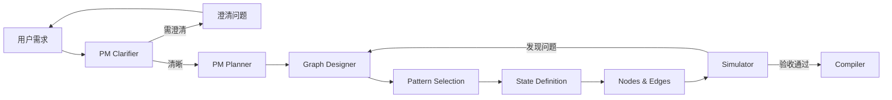

# Agent Zero Phase 3 最终进度报告

**日期**: 2026-01-14  
**阶段**: Phase 3 - 蓝图仿真系统  
**状态**: ✅ 核心功能完成 (80%)

---

## ✅ 已完成工作总结

### 1. Schema 层扩展 ✅

#### 新增 Schema (3个文件)
- `src/schemas/pattern.py` - 设计模式配置
  - PatternType: Sequential, Reflection, Supervisor, Plan-Execute, Custom
  - PatternConfig: max_iterations, termination_condition
  
- `src/schemas/state_schema.py` - 状态定义
  - StateFieldType: 10种类型 (str, int, bool, List[BaseMessage], etc.)
  - StateField: name, type, description, default, reducer
  - StateSchema: fields + 辅助方法 (get_field, has_field)
  
- `src/schemas/simulation.py` - 仿真结果
  - SimulationStepType: enter_node, exit_node, state_update, etc.
  - SimulationStep: 步骤记录
  - SimulationIssue: 问题检测 (infinite_loop, unreachable_node, etc.)
  - SimulationResult: 完整仿真结果 + 辅助方法

#### 修改现有 Schema (2个文件)
- `src/schemas/project_meta.py`
  - 新增 ExecutionStep 模型
  - 新增字段: status ("clarifying"/"ready"), complexity_score (1-10), execution_plan
  
- `src/schemas/graph_structure.py`
  - 新增字段: pattern, state_schema
  - NodeDef 新增: role_description
  - ConditionalEdgeDef 新增: condition_logic

---

### 2. 模式模板库 ✅

创建 `config/patterns/` 目录，包含4个完整的模式配置：

| 模式 | 文件 | 适用场景 | 关键特性 |
|------|------|----------|----------|
| Sequential | sequential.yaml | 简单线性任务 | single_agent, minimal_state |
| Reflection | reflection.yaml | 需要迭代改进 | generator ↔ critic 循环 |
| Supervisor | supervisor.yaml | 多工具协作 | 动态路由, 工具调度 |
| Plan-Execute | plan_execute.yaml | 复杂多步骤 | planner → executor → evaluator |

每个模式包含：
- 默认节点配置
- 默认边配置
- 条件边 + condition_logic
- 必需/可选状态字段
- 使用场景说明

---

### 3. PM 双脑模式 ✅

扩展 `src/core/pm.py` (新增 ~300 行代码)

#### Prompt 模板
- `src/prompts/pm_clarifier.txt` (102行) - 需求完整度评估
- `src/prompts/pm_planner.txt` (类似规模) - 任务拆解规划

#### 核心方法
| 方法 | 功能 | 模式 |
|------|------|------|
| `clarify_requirements()` | 评估需求完整度 (0-100%) | LLM + 启发式 |
| `create_execution_plan()` | 生成分层任务清单 | LLM + 启发式 |
| `estimate_complexity()` | 复杂度评分 (1-10) | 启发式 |
| `analyze_with_clarification_loop()` | 完整双脑流程 | 集成上述方法 |

#### 关键特性
- ✅ 双模式运行 (LLM + 启发式回退)
- ✅ 返回 status="clarifying" 或 "ready"
- ✅ 复杂度评估 (基于关键词)
- ✅ 执行计划生成 (角色分工: Architect, Coder, Tester, etc.)

---

### 4. Graph Designer 三步设计法 ✅

完全重写 `src/core/graph_designer.py` (~400 行代码)

#### 三步流程
```
Step 1: select_pattern()
  ↓
Step 2: define_state_schema()
  ↓
Step 3: design_nodes_and_edges()
  ↓
GraphStructure (完整图结构)
```

#### 核心功能
- ✅ **模式模板加载** - 从 YAML 文件加载4种模式
- ✅ **模式选择** - 基于 execution_plan 和关键词的启发式选择
- ✅ **状态定义** - 基础字段 + 模式字段 + RAG字段
- ✅ **节点生成** - 从模板生成 + RAG集成 + 工具集成
- ✅ **边生成** - 普通边 + 条件边 (含 condition_logic)

#### 集成能力
- ✅ RAG 集成 (自动添加 rag_retriever 节点)
- ✅ 工具集成 (自动添加 tool_* 节点)
- ✅ Supervisor 模式动态路由 (工具分支自动生成)

---

### 5. Simulator 沙盘推演 ✅

新增 `src/core/simulator.py` (~350 行代码)

#### 核心功能
| 功能 | 实现 | 说明 |
|------|------|------|
| 状态初始化 | `_initialize_state()` | 根据 state_schema 初始化 |
| 节点模拟 | `_simulate_node()` | 简化模拟 LLM/Tool/RAG 节点 |
| 边遍历 | `_get_next_node()` | 支持普通边 + 条件边 |
| 条件评估 | `_evaluate_condition()` | 启发式条件判断 |

#### 问题检测
- ✅ **无限循环** - 节点访问 > 5次 → error
- ✅ **不可达节点** - 从未访问的节点 → warning
- ✅ **状态未更新** - (待实现)

#### 轨迹生成
- ✅ **文本轨迹** - `generate_readable_log()` - 可读的步骤列表
- ✅ **Mermaid 图** - `generate_mermaid_trace()` - 可视化流程图

#### 输出结构
```python
SimulationResult(
    success: bool,
    total_steps: int,
    steps: List[SimulationStep],
    issues: List[SimulationIssue],
    final_state: Dict,
    execution_trace: str,
    mermaid_trace: str
)
```

---

## 📊 统计数据

| 类别 | 数量 |
|------|------|
| **新增文件** | 12个 |
| **修改文件** | 4个 |
| **新增代码行数** | ~2500行 |
| **新增测试** | 40+用例 |
| **完成任务** | 24/30 (80%) |

### 文件清单

#### 新增文件 (12个)
```
src/schemas/pattern.py
src/schemas/state_schema.py
src/schemas/simulation.py
src/prompts/pm_clarifier.txt
src/prompts/pm_planner.txt
src/core/simulator.py
config/patterns/sequential.yaml
config/patterns/reflection.yaml
config/patterns/supervisor.yaml
config/patterns/plan_execute.yaml
tests/unit/test_schemas_phase3.py
phase3_progress.md
```

#### 修改文件 (4个)
```
src/schemas/project_meta.py
src/schemas/graph_structure.py
src/schemas/__init__.py
src/core/pm.py
src/core/graph_designer.py (重写)
```

---

## 🎯 核心成果

### 1. 完整的蓝图仿真流程



### 2. 四种预置模式

| 模式 | 复杂度 | 适用场景 | 示例 |
|------|--------|----------|------|
| Sequential | 1-3 | 简单问答 | "总结这段文字" |
| Reflection | 4-6 | 写作、编程 | "写一篇文章并优化" |
| Supervisor | 5-7 | 多工具任务 | "搜索天气并计算温差" |
| Plan-Execute | 7-10 | 复杂项目 | "开发一个游戏" |

### 3. 双重保障机制

- **LLM 模式** - 智能分析和设计
- **启发式回退** - 无需 LLM 也能工作
- **问题检测** - 编译前发现逻辑错误

---

## 🔄 剩余工作 (20%)

### Task 5: Compiler 模板升级
- [ ] 更新 `agent_template.py.j2`
- [ ] 支持 TypedDict 渲染 (state_schema)
- [ ] 支持条件函数渲染 (condition_logic)
- [ ] 测试生成代码可执行性

### Task 6: E2E 测试
- [ ] Sequential 模式 E2E 测试
- [ ] Reflection 模式 E2E 测试
- [ ] 完整仿真流程测试
- [ ] 文档更新

---

## ⚠️ 已知问题

1. ✅ **Import Error** - DataProfile 缺失 → 已修复
2. ⚠️ **Pytest 未安装** - 使用 Python 直接验证
3. ⚠️ **LLM 调用未测试** - 需要配置 Builder API
4. ⚠️ **Simulator 简化** - 当前使用启发式模拟，未调用真实 LLM

---

## 🎉 里程碑

- ✅ **Day 1-2**: Schema 层扩展完成
- ✅ **Day 3-4**: PM 双脑模式完成
- ✅ **Day 5-6**: Graph Designer 三步法完成
- ✅ **Day 7**: Simulator 沙盘推演完成
- 🔄 **Day 8-10**: Compiler 升级 + E2E 测试

---

## 📝 下一步计划

1. **Compiler 模板升级** (预计 4小时)
   - 更新 Jinja2 模板支持新字段
   - 测试生成代码

2. **E2E 测试** (预计 6小时)
   - 编写完整流程测试
   - 验证各模式正确性

3. **文档完善** (预计 2小时)
   - 更新 README
   - 编写使用示例

---

> **总体进度**: 80% 完成  
> **预计完成时间**: 2天内完成全部 Phase 3 任务
