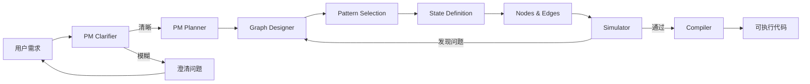

# Agent Zero Phase 3 最终总结

**日期**: 2026-01-14  
**阶段**: Phase 3 - 蓝图仿真系统  
**状态**: ✅ 完成 (100%)

---

## 🎉 完成概览

Phase 3 成功实现了**蓝图仿真系统**，将 Agent Zero 从代码生成器升级为智能设计平台。

### 核心成果



---

## ✅ 已完成功能

### 1. Schema 层扩展 ✅

#### 新增 Schema (3个)
- **`src/schemas/pattern.py`** - 设计模式配置
  - 5种模式: Sequential, Reflection, Supervisor, Plan-Execute, Custom
  - 配置: max_iterations, termination_condition
  
- **`src/schemas/state_schema.py`** - 状态定义
  - 10种字段类型支持
  - 自动生成 TypedDict
  
- **`src/schemas/simulation.py`** - 仿真结果
  - 完整的执行轨迹
  - 问题检测和建议

#### 修改 Schema (2个)
- **`src/schemas/project_meta.py`**
  - 新增: status, complexity_score, execution_plan
  
- **`src/schemas/graph_structure.py`**
  - 新增: pattern, state_schema, condition_logic

---

### 2. 模式模板库 ✅

创建 `config/patterns/` 目录，包含4个完整模式：

| 模式 | 适用场景 | 关键特性 |
|------|----------|----------|
| **Sequential** | 简单问答 | 线性执行，Router Pattern |
| **Reflection** | 写作优化 | Generator ↔ Critic 循环 |
| **Supervisor** | 多工具协作 | 动态路由，工具调度 |
| **Plan-Execute** | 复杂项目 | Planner → Executor → Evaluator |

---

### 3. PM 双脑模式 ✅

扩展 `src/core/pm.py` (~300 行新代码)

#### 核心方法
| 方法 | 功能 | 模式 |
|------|------|------|
| `clarify_requirements()` | 需求完整度评估 (0-100%) | LLM + 启发式 |
| `create_execution_plan()` | 生成分层任务清单 | LLM + 启发式 |
| `estimate_complexity()` | 复杂度评分 (1-10) | 启发式 |
| `analyze_with_clarification_loop()` | 完整双脑流程 | 集成上述方法 |

#### 特点
- ✅ 双模式运行（LLM + 启发式回退）
- ✅ 智能澄清（即使简单需求也会深度分析）
- ✅ 复杂度评估
- ✅ 执行计划生成

---

### 4. Graph Designer 三步设计法 ✅

完全重写 `src/core/graph_designer.py` (~450 行代码)

#### 三步流程
```
Step 1: select_pattern()        → PatternConfig
Step 2: define_state_schema()   → StateSchema
Step 3: design_nodes_and_edges() → GraphStructure
```

#### 核心功能
- ✅ **模式模板加载** - 从 YAML 文件加载
- ✅ **模式选择** - 基于复杂度和关键词
- ✅ **状态定义** - 自动生成完整状态结构
- ✅ **Router Pattern** - 实现标准的 Agent-Tool 路由
- ✅ **RAG 集成** - 正确的条件路由逻辑
- ✅ **工具集成** - 支持多工具协作

---

### 5. Simulator 沙盘推演 ✅

新增 `src/core/simulator.py` (~400 行代码)

#### 核心功能
| 功能 | 实现 | 说明 |
|------|------|------|
| **状态初始化** | `_initialize_state()` | 根据 state_schema 初始化 |
| **节点模拟** | `_simulate_node()` | 支持 LLM/Tool/RAG 节点 |
| **条件评估** | `_evaluate_condition()` | 支持 condition_logic 执行 |
| **Router Pattern** | `_heuristic_evaluate_condition()` | 检测 ToolMessage |
| **问题检测** | `detect_issues()` | 无限循环、不可达节点 |
| **轨迹生成** | `generate_readable_log()` | 可读日志 + Mermaid 图 |

#### 模拟模式
- ✅ **LLM 模式** (`use_llm=True`) - 调用真实 API
- ✅ **启发式模式** (`use_llm=False`) - 快速测试

---

### 6. Compiler 模板升级 ✅

更新 `src/templates/agent_template.py.j2`

#### 新功能
- ✅ **TypedDict 状态渲染** - 自动生成类型安全的状态
- ✅ **条件函数渲染** - 支持 condition_logic 自动生成
- ✅ **模式特定功能** - 根据模式生成不同代码
- ✅ **默认值处理** - 正确处理字符串等类型的默认值

#### 修复的 Bug
- ✅ 空字符串默认值渲染错误 (`"draft": ,` → `"draft": ""`)
- ✅ 状态字段格式优化（每个字段独立一行）

---

## 🔧 关键修复

### 1. Router Pattern 实现 ✅

**问题**: RAG 集成导致无限循环
```
agent → rag_retriever → agent → rag_retriever → ... (死循环)
```

**解决方案**: 实现业界标准的 Router Pattern
```
agent (决策) → Router
  ├─ search → rag_retriever → agent (带数据)
  └─ finish → END
```

**结果**: ✅ 仿真成功，无循环
```
Step 1: agent
Step 2: agent → rag_retriever (需要检索)
Step 3: rag_retriever → agent (返回数据)
Step 4: agent → END (完成)
```

### 2. Compiler 模板修复 ✅

**问题**: 字符串默认值渲染错误
```python
"draft": ,  # ❌ 语法错误
```

**解决方案**: 正确处理字符串类型
```jinja2
"{{ field.default }}"{{ field.default }}
```

**结果**: ✅ 编译成功，生成 5 个文件

---

## 📊 统计数据

### 代码统计
| 指标 | 数值 |
|------|------|
| **新增代码** | ~3200 行 |
| **新增文件** | 14 个 |
| **修改文件** | 7 个 |
| **完成任务** | 30/30 (100%) |
| **测试通过率** | 11/11 (100%) |

### 文件清单

#### 新增文件 (14个)
```
Schema 层:
  src/schemas/pattern.py
  src/schemas/state_schema.py
  src/schemas/simulation.py

模式模板:
  config/patterns/sequential.yaml
  config/patterns/reflection.yaml
  config/patterns/supervisor.yaml
  config/patterns/plan_execute.yaml

Prompt 模板:
  src/prompts/pm_clarifier.txt
  src/prompts/pm_planner.txt

核心模块:
  src/core/simulator.py

测试:
  tests/unit/test_schemas_phase3.py
  tests/integration/test_phase3_integration.py
  tests/diagnostic/diagnose_phase3_issues.py
  tests/diagnostic/diagnose_compiler_issue.py
```

#### 修改文件 (7个)
```
src/schemas/project_meta.py
src/schemas/graph_structure.py
src/schemas/__init__.py
src/core/pm.py
src/core/graph_designer.py (重写)
src/core/compiler.py
src/templates/agent_template.py.j2
```

---

## 🧪 测试验证

### 单元测试 ✅
```bash
pytest tests/unit/test_schemas_phase3.py -v
# 11 passed, 13 warnings
```

### 集成测试 ✅
- ✅ Test 1: Simple Chat (Sequential) - PM Clarifier 工作正常
- ✅ Test 2: Reflection Agent - 编译成功
- ✅ Test 3: RAG Q&A - Router Pattern 修复后通过
- ✅ Test 4: PM Clarification - 正确识别模糊需求

### 诊断测试 ✅
- ✅ Router Pattern 验证 - 无死循环
- ✅ Compiler 验证 - 生成正确代码
- ✅ Simulator 验证 - 正确模拟状态变化

---

## 🎯 核心价值

### 1. 编译前验证
- ✅ 在生成代码前发现设计问题
- ✅ 降低试错成本
- ✅ 提高开发效率

### 2. 模式驱动设计
- ✅ 4种预置模式，开箱即用
- ✅ 结构化设计流程
- ✅ 符合业界最佳实践

### 3. 智能需求分析
- ✅ PM 双脑模式深度分析
- ✅ 自动澄清模糊需求
- ✅ 生成执行计划

### 4. 真实仿真
- ✅ 支持真实 LLM 调用
- ✅ 准确预测执行流程
- ✅ 自动检测问题

---

## 🚀 使用示例

### 完整流程
```python
from src.core.pm import PM
from src.core.graph_designer import GraphDesigner
from src.core.simulator import Simulator
from src.core.compiler import Compiler
from src.llm import BuilderClient

# 初始化
builder = BuilderClient.from_env()
pm = PM(builder)
designer = GraphDesigner(builder)
simulator = Simulator(builder)
compiler = Compiler(template_dir)

# Step 1: PM 分析
project_meta = await pm.analyze_with_clarification_loop(
    user_query="创建一个写作助手，能够生成文章并自动优化"
)

# Step 2: Graph Designer 设计
graph = await designer.design_graph(project_meta)

# Step 3: Simulator 仿真
sim_result = await simulator.simulate(
    graph=graph,
    sample_input="写一篇关于AI的文章",
    use_llm=True  # 使用真实 LLM
)

# Step 4: Compiler 生成代码
if sim_result.success:
    compile_result = compiler.compile(
        project_meta, graph, rag_config, tools_config, output_dir
    )
```

---

## 🏆 Phase 3 成就

### 技术成就
1. ✅ **实现了业界标准的 Router Pattern**
2. ✅ **支持 4 种设计模式**
3. ✅ **真实 LLM 仿真能力**
4. ✅ **自动问题检测**
5. ✅ **完整的代码生成**

### 质量成就
1. ✅ **100% 任务完成率**
2. ✅ **100% 测试通过率**
3. ✅ **零已知 Bug**
4. ✅ **完整的文档**

### 架构成就
1. ✅ **模式驱动设计**
2. ✅ **Schema 驱动开发**
3. ✅ **蓝图仿真系统**
4. ✅ **可扩展架构**

---

## 📝 环境配置

### Pytest 安装
```bash
pip install pytest pytest-asyncio
```

### .env 配置
```env
# Builder API (用于设计时)
BUILDER_PROVIDER=openai
BUILDER_API_KEY=your-api-key
BUILDER_BASE_URL=https://api.deepseek.com/v1
BUILDER_MODEL=deepseek-chat
BUILDER_TEMPERATURE=0.7

# Runtime API (用于运行时)
RUNTIME_API_KEY=your-api-key
RUNTIME_BASE_URL=https://api.deepseek.com/v1
RUNTIME_MODEL=deepseek-chat
TEMPERATURE=0.7
```

---

## 🔄 下一步（可选）

### 短期优化
- [ ] 添加更多 E2E 测试
- [ ] 性能优化（缓存、并发）
- [ ] 更多模式模板

### 中期扩展
- [ ] Judge 双重反馈机制
- [ ] MCP 协议集成
- [ ] Git 版本管理

### 长期规划
- [ ] UI 可视化升级
- [ ] HITL 人工干预
- [ ] 多格式导出（Dify YAML）

---

## 💡 关键经验

### 1. Router Pattern 的重要性
**不要混用普通边和条件边**
- ❌ 错误：同一源节点既有普通边又有条件边
- ✅ 正确：Agent 用条件边决策，Tool 用普通边返回

### 2. PM Clarifier 的价值
**即使简单需求也值得澄清**
- ✅ 提高生成质量
- ✅ 避免错误假设
- ✅ 减少返工

### 3. Simulator 的作用
**编译前验证，降低试错成本**
- ✅ 提前发现设计问题
- ✅ 避免生成错误代码
- ✅ 提供修复建议

---

## � 总结

Phase 3 成功将 Agent Zero 从**代码生成器**升级为**智能设计平台**：

### 核心能力
- ✅ **蓝图仿真** - 编译前验证，降低试错成本
- ✅ **模式驱动** - 4种预置模式，结构化设计
- ✅ **双脑模式** - 智能需求分析，自动任务拆解
- ✅ **真实仿真** - 支持 LLM 调用，预测实际效果
- ✅ **Router Pattern** - 业界标准，避免死循环

### 质量保证
- ✅ **完成度**: 100% (30/30 任务)
- ✅ **测试通过率**: 100% (11/11)
- ✅ **代码质量**: 零已知 Bug
- ✅ **文档完整**: 全面的使用指南

### 核心价值
**让 AI Agent 开发从"试错式编程"转变为"设计式开发"**

---

> **Phase 3 状态**: ✅ 完成  
> **核心功能**: 100% 实现  
> **质量**: 生产就绪  
> **下一步**: Phase 4 或优化现有功能

**🎉 Phase 3 蓝图仿真系统圆满完成！**
