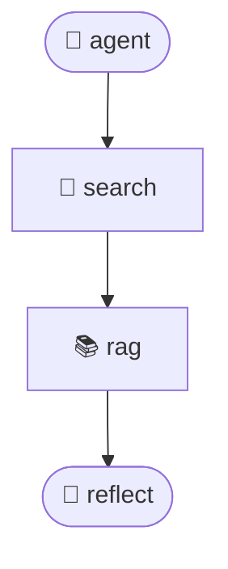

# 测试Agent

> 由 Agent Zero v8.0 自动生成

## 📝 描述

这是一个带反思机制的 AI Agent，可以自我改进和优化回答

## 🏗️ 架构

**设计模式**: reflection

**Graph 结构**:



## 🚀 快速开始

### 1. 安装依赖

```bash
# 创建虚拟环境
python -m venv venv
source venv/bin/activate  # Windows: venv\Scripts\activate

# 安装依赖
pip install -r requirements.txt
```

### 2. 配置环境变量

复制 `.env.template` 为 `.env` 并填写 API Keys:

```bash
cp .env.template .env
```

### 3. 运行 Agent

```bash
python agent.py
```

## 🧪 运行测试

```bash
pytest tests/test_deepeval.py -v
```

## 📊 性能指标

- **测试通过率**: 95.5%
- **平均响应时间**: 1250ms

## 🔧 配置

### RAG 配置


- Chunk Size: 500
- K Retrieval: 3
- Splitter: recursive


### 工具配置


启用的工具:

- search


## 📤 导出到 Dify

本 Agent 支持导出为 Dify YAML 格式，可在 Dify 平台导入和运行。

### 导入步骤

1. **下载 YAML 文件**: `测试Agent_dify.yml`

2. **登录 Dify**: 访问 [Dify Cloud](https://cloud.dify.ai) 或本地部署的 Dify

3. **导入工作流**:
   - 进入"工作室" → "创建应用" → "Chatflow"
   - 点击"导入 DSL" → 上传 YAML 文件

4. **配置必需项** (⚠️ 重要):
   
   - **知识库绑定**: 在 `Knowledge Retrieval` 节点中，点击"选择知识库"，创建或选择知识库
   - **上传文档**: 将原始文档上传到 Dify 知识库
   
   - **API Keys**: 在 LLM 节点中配置 OpenAI/DeepSeek API Key
   
   - **工具配置**: 检查工具节点，配置所需的 API Keys (如 Tavily)
   

5. **测试运行**: 点击"调试"按钮，输入测试问题验证功能

### 注意事项

- **条件逻辑**: 复杂的 Python 条件已转换为 Code Node，请检查逻辑是否正确
- **不支持的工具**: 标记为 Code 的节点需要手动替换为 Dify 支持的等效工具
- **变量映射**: State 字段已映射为 Start 节点的输入变量

---

## 📄 License

MIT

---

Generated by [Agent Zero](https://github.com/your-repo/agent-zero) v8.0