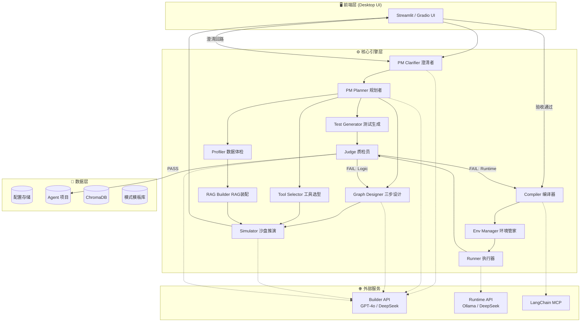
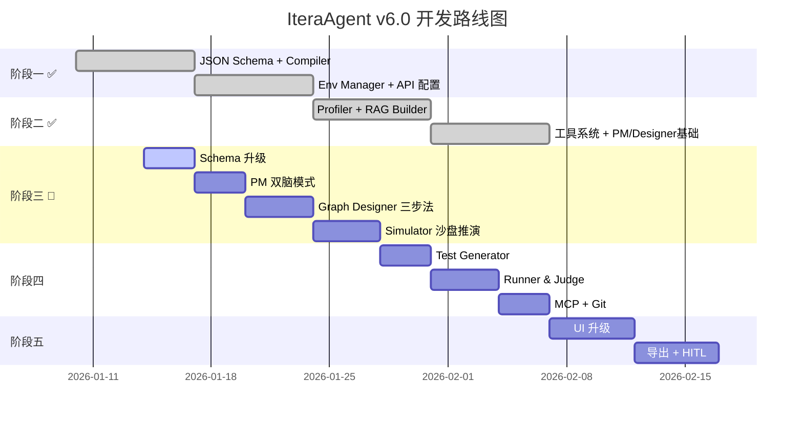

# IteraAgent v6.0 详细实施计划

> **项目愿景**: 打造一款桌面端、本地化、全自动的智能体构建工厂，通过蓝图仿真将自然语言转化为 LangGraph 拓扑。

---

## 🏗️ 系统架构设计

### 1. 整体架构图



### 2. 技术栈选型

| 层级 | 技术选型 | 版本建议 |
|:-----|:---------|:---------|
| **编程语言** | Python | 3.11+ |
| **LLM 框架** | LangChain + LangGraph | langchain>=0.2.0, langgraph>=0.1.0 |
| **向量数据库** | ChromaDB | chromadb>=0.4.22 |
| **文档解析** | Unstructured | unstructured>=0.12.0 |
| **模板引擎** | Jinja2 | jinja2>=3.1.2 |
| **数据校验** | Pydantic | pydantic>=2.5.0 |
| **UI 框架** | Streamlit | streamlit>=1.30.0 |
| **进程管理** | subprocess (标准库) | Python 内置 |
| **版本控制** | GitPython | gitpython>=3.1.40 |

---

## 📁 项目文件结构

```text
IteraAgent/
├── 📂 src/                          # 源代码目录
│   ├── 📂 core/                     # 核心引擎
│   │   ├── __init__.py
│   │   ├── pm.py                    # PM 需求分析师 (双脑模式)
│   │   ├── graph_designer.py        # 图设计师 (三步设计法)
│   │   ├── tool_selector.py         # 工具选型
│   │   ├── profiler.py              # 数据体检
│   │   ├── rag_builder.py           # RAG 装配工
│   │   ├── simulator.py             # [新增] 沙盘推演
│   │   ├── test_generator.py        # 测试用例生成
│   │   ├── compiler.py              # 编译器
│   │   ├── env_manager.py           # 环境管家
│   │   ├── runner.py                # 本地执行器
│   │   ├── judge.py                 # 质检员 (双重反馈)
│   │   └── orchestrator.py          # [新增] 流程编排器
│   │
│   ├── 📂 schemas/                  # Pydantic 数据模型
│   │   ├── __init__.py
│   │   ├── project_meta.py          # 项目元信息 (含 execution_plan)
│   │   ├── graph_structure.py       # 图结构 (含 pattern, state_schema)
│   │   ├── state_schema.py          # [新增] 状态定义模型
│   │   ├── pattern.py               # [新增] 设计模式模型
│   │   ├── simulation.py            # [新增] 仿真结果模型
│   │   ├── rag_config.py            # RAG 配置
│   │   ├── tools_config.py          # 工具配置
│   │   ├── test_cases.py            # 测试用例
│   │   └── execution_result.py      # 执行结果
│   │
│   ├── 📂 templates/                # Jinja2 代码模板
│   │   ├── agent_template.py.j2     # Agent 主程序模板 (支持 TypedDict)
│   │   ├── rag_template.py.j2       # RAG 模块模板
│   │   ├── prompts_template.yaml.j2 # Prompt 配置模板
│   │   └── 📂 patterns/             # [新增] 模式模板库
│   │       ├── sequential.j2
│   │       ├── reflection.j2
│   │       ├── supervisor.j2
│   │       └── plan_execute.j2
│   │
│   ├── 📂 prompts/                  # [新增] Prompt 模板
│   │   ├── pm_clarifier.txt
│   │   ├── pm_planner.txt
│   │   ├── graph_designer.txt
│   │   └── simulator.txt
│   │
│   ├── 📂 tools/                    # 内置工具库
│   │   ├── __init__.py
│   │   ├── registry.py              # 工具注册表
│   │   └── preset_tools.py          # 预置工具
│   │
│   ├── 📂 llm/                      # LLM 客户端封装
│   │   ├── __init__.py
│   │   ├── builder_client.py
│   │   ├── runtime_client.py
│   │   └── mcp_client.py
│   │
│   └── 📂 utils/                    # 工具函数
│       ├── __init__.py
│       ├── file_utils.py
│       ├── git_utils.py
│       └── validation.py
│
├── 📂 config/                       # 系统配置
│   ├── builder_api.yaml
│   ├── runtime_api.yaml
│   ├── tool_registry.yaml
│   └── 📂 patterns/                 # [新增] 模式配置
│       ├── sequential.yaml
│       ├── reflection.yaml
│       ├── supervisor.yaml
│       └── plan_execute.yaml
│
├── 📂 agents/                       # 生成的 Agent 项目
├── 📂 tests/                        # 测试代码
├── 📂 docs/                         # 文档
├── requirements.txt
├── pyproject.toml
└── README.md
```

---

## 📐 核心数据结构定义 (Pydantic Schemas)

### 1. project_meta.py - 项目元信息 [升级]

```python
from pydantic import BaseModel, Field
from typing import Optional, List, Literal
from enum import Enum

class TaskType(str, Enum):
    CHAT = "chat"
    SEARCH = "search"
    ANALYSIS = "analysis"
    RAG = "rag"
    CUSTOM = "custom"

class ExecutionStep(BaseModel):
    """执行计划步骤"""
    step: int = Field(..., description="步骤序号")
    role: str = Field(..., description="角色名称 (Architect/Coder/Tester等)")
    goal: str = Field(..., description="步骤目标")
    expected_output: Optional[str] = Field(None, description="预期输出")

class ProjectMeta(BaseModel):
    """PM 节点输出的项目元信息"""
    # 基础字段
    agent_name: str = Field(..., min_length=1, max_length=50)
    description: str
    has_rag: bool = Field(default=False)
    task_type: TaskType = Field(default=TaskType.CHAT)
    language: str = Field(default="zh-CN")
    user_intent_summary: str
    file_paths: Optional[List[str]] = None
    
    # 新增字段 - 双脑模式
    status: Literal["clarifying", "ready"] = Field(default="ready")
    clarification_questions: Optional[List[str]] = None
    complexity_score: int = Field(default=1, ge=1, le=10)
    execution_plan: Optional[List[ExecutionStep]] = None
```

### 2. pattern.py - 设计模式 [新增]

```python
from pydantic import BaseModel, Field
from enum import Enum
from typing import Optional

class PatternType(str, Enum):
    SEQUENTIAL = "sequential"      # A -> B -> C
    REFLECTION = "reflection"      # Generate <-> Critique
    SUPERVISOR = "supervisor"      # Manager -> [Workers] -> Manager
    PLAN_EXECUTE = "plan_execute"  # Planner -> Executor -> Replanner
    CUSTOM = "custom"

class PatternConfig(BaseModel):
    """设计模式配置"""
    pattern_type: PatternType = Field(..., description="模式类型")
    max_iterations: int = Field(default=3, ge=1, le=10, description="最大循环次数")
    termination_condition: Optional[str] = Field(None, description="终止条件表达式")
    description: str = Field(default="", description="模式说明")
```

### 3. state_schema.py - 状态定义 [新增]

```python
from pydantic import BaseModel, Field
from typing import List, Optional, Any
from enum import Enum

class StateFieldType(str, Enum):
    STRING = "str"
    INT = "int"
    BOOL = "bool"
    LIST_MESSAGE = "List[BaseMessage]"
    LIST_STR = "List[str]"
    DICT = "Dict[str, Any]"
    OPTIONAL_STR = "Optional[str]"

class StateField(BaseModel):
    """状态字段定义"""
    name: str = Field(..., description="字段名")
    type: StateFieldType = Field(..., description="字段类型")
    description: Optional[str] = Field(None, description="字段说明")
    default: Optional[Any] = Field(None, description="默认值")
    reducer: Optional[str] = Field(None, description="归约函数 (如 add_messages)")

class StateSchema(BaseModel):
    """完整状态定义"""
    fields: List[StateField] = Field(..., description="状态字段列表")
```

### 4. graph_structure.py - 图结构 [升级]

```python
from pydantic import BaseModel, Field, model_validator
from typing import List, Dict, Optional, Literal

class NodeDef(BaseModel):
    """图节点定义"""
    id: str = Field(..., description="节点唯一标识")
    type: Literal["llm", "tool", "rag", "conditional", "custom"]
    role_description: Optional[str] = Field(None, description="角色描述，用于 Prompt")
    config: Optional[Dict] = None

class EdgeDef(BaseModel):
    """普通边定义"""
    source: str
    target: str

class ConditionalEdgeDef(BaseModel):
    """条件边定义 [升级]"""
    source: str
    condition: str = Field(..., description="条件函数名")
    condition_logic: Optional[str] = Field(None, description="条件逻辑表达式")
    branches: Dict[str, str]

class GraphStructure(BaseModel):
    """完整的图结构定义 [升级]"""
    # 新增字段
    pattern: PatternConfig = Field(..., description="设计模式")
    state_schema: StateSchema = Field(..., description="状态定义")
    
    # 原有字段
    nodes: List[NodeDef] = Field(..., min_length=1)
    edges: List[EdgeDef] = Field(default_factory=list)
    conditional_edges: List[ConditionalEdgeDef] = Field(default_factory=list)
    entry_point: str = Field(default="agent")
```

### 5. simulation.py - 仿真结果 [新增]

```python
from pydantic import BaseModel, Field
from typing import List, Optional
from enum import Enum
from datetime import datetime

class SimulationStepType(str, Enum):
    ENTER_NODE = "enter_node"
    EXIT_NODE = "exit_node"
    STATE_UPDATE = "state_update"
    CONDITION_CHECK = "condition_check"
    EDGE_TRAVERSE = "edge_traverse"

class SimulationStep(BaseModel):
    """仿真步骤"""
    step_number: int
    step_type: SimulationStepType
    node_id: Optional[str] = None
    description: str
    state_snapshot: Optional[Dict] = None

class SimulationIssue(BaseModel):
    """仿真发现的问题"""
    issue_type: Literal["infinite_loop", "unreachable_node", "missing_edge", "invalid_condition"]
    severity: Literal["error", "warning"]
    description: str
    affected_nodes: List[str]

class SimulationResult(BaseModel):
    """仿真结果"""
    success: bool
    total_steps: int
    steps: List[SimulationStep]
    issues: List[SimulationIssue] = Field(default_factory=list)
    final_state: Optional[Dict] = None
    execution_trace: str = Field(..., description="可读的执行轨迹文本")
    mermaid_trace: Optional[str] = Field(None, description="Mermaid 格式的轨迹图")
    simulated_at: datetime = Field(default_factory=datetime.now)
```

---

## 🔧 各模块详细开发任务

### 阶段一：内核 MVP (Week 1-2) ✅ 已完成

- [x] JSON Schema 体系
- [x] Compiler 编译器
- [x] Env Manager 环境管家
- [x] API 双轨配置 (Builder/Runtime)
- [x] Hello World Agent 联调

### 阶段二：数据流与工具 (Week 3-4) ✅ 已完成

- [x] Profiler 数据体检
- [x] RAG Builder 策略设计
- [x] Tool Registry 工具注册表
- [x] Tool Selector 工具选型
- [x] PM 基础实现
- [x] Graph Designer 基础实现
- [x] 预置工具 (5个)
- [x] 单元测试 + E2E 测试

---

### 阶段三：蓝图仿真系统 (Week 5-6) ✅ 已完成

#### Task 3.1: Schema 层升级

**新增文件**: 
- `src/schemas/pattern.py`
- `src/schemas/state_schema.py`
- `src/schemas/simulation.py`

**修改文件**:
- `src/schemas/project_meta.py` - 添加 status, execution_plan, complexity_score
- `src/schemas/graph_structure.py` - 添加 pattern, state_schema, condition_logic

**工作内容**:
1. 实现 PatternConfig 模型
2. 实现 StateSchema 模型
3. 实现 SimulationResult 模型
4. 更新 ProjectMeta 添加双脑模式字段
5. 更新 GraphStructure 添加模式和状态字段
6. 编写 Schema 单元测试

---

#### Task 3.2: PM 双脑模式升级

**修改文件**: `src/core/pm.py`

```python
class PMAnalyzer:
    def __init__(self, llm_client: BuilderClient):
        self.llm = llm_client
    
    async def clarify_requirements(
        self, 
        user_query: str,
        chat_history: List[Dict]
    ) -> Tuple[bool, Optional[List[str]]]:
        """
        澄清者角色：检查需求完整度
        
        Returns:
            (is_ready, clarification_questions)
        """
        # 使用 LLM 评估需求完整度
        # 如果 < 80%，生成澄清问题
        pass
    
    async def create_execution_plan(
        self,
        project_meta: ProjectMeta
    ) -> List[ExecutionStep]:
        """
        规划者角色：生成分层任务清单
        
        针对复杂任务生成:
        - 角色分工 (Architect, Coder, Tester)
        - 步骤目标
        - 预期输出
        """
        pass
    
    async def estimate_complexity(
        self,
        user_query: str,
        has_files: bool
    ) -> int:
        """评估任务复杂度 (1-10)"""
        pass
    
    async def analyze_with_clarification_loop(
        self,
        user_query: str,
        chat_history: List[Dict],
        file_paths: Optional[List[str]] = None
    ) -> ProjectMeta:
        """
        完整的双脑模式分析流程:
        1. 澄清者检查需求
        2. 如需澄清，返回 status="clarifying"
        3. 否则，规划者生成执行计划
        4. 返回 status="ready" 的 ProjectMeta
        """
        pass
```

**新增 Prompt**: `src/prompts/pm_clarifier.txt`, `src/prompts/pm_planner.txt`

---

#### Task 3.3: Graph Designer 三步设计法

**修改文件**: `src/core/graph_designer.py`

```python
class GraphDesigner:
    def __init__(self, llm_client: BuilderClient):
        self.llm = llm_client
        self.pattern_templates = self._load_pattern_templates()
    
    def _load_pattern_templates(self) -> Dict[PatternType, Dict]:
        """加载模式模板库"""
        pass
    
    async def select_pattern(
        self,
        project_meta: ProjectMeta
    ) -> PatternConfig:
        """
        Step 1: 选择设计模式
        
        基于:
        - execution_plan 的步骤数
        - 是否需要反思/迭代
        - 是否需要多角色协作
        """
        pass
    
    async def define_state_schema(
        self,
        project_meta: ProjectMeta,
        pattern: PatternConfig
    ) -> StateSchema:
        """
        Step 2: 定义状态结构
        
        必须包含:
        - messages (对话历史)
        - 循环控制变量 (retry_count)
        - 终止标志 (is_finished)
        """
        pass
    
    async def design_nodes_and_edges(
        self,
        project_meta: ProjectMeta,
        pattern: PatternConfig,
        state_schema: StateSchema,
        tools_config: Optional[ToolsConfig] = None,
        rag_config: Optional[RAGConfig] = None
    ) -> GraphStructure:
        """
        Step 3: 设计节点和边
        
        包括:
        - 基于 pattern 模板生成基础结构
        - 添加工具节点 (如有)
        - 添加 RAG 节点 (如有)
        - 生成条件边的 condition_logic
        """
        pass
    
    async def design_graph(
        self,
        project_meta: ProjectMeta,
        tools_config: Optional[ToolsConfig] = None,
        rag_config: Optional[RAGConfig] = None
    ) -> GraphStructure:
        """完整的三步设计流程"""
        pattern = await self.select_pattern(project_meta)
        state_schema = await self.define_state_schema(project_meta, pattern)
        graph = await self.design_nodes_and_edges(
            project_meta, pattern, state_schema, tools_config, rag_config
        )
        return graph
```

**新增配置**: `config/patterns/*.yaml`

```yaml
# config/patterns/reflection.yaml
name: reflection
description: "生成-批评循环模式，适用于需要迭代改进的任务"
default_nodes:
  - id: generator
    type: llm
    role_description: "生成初始输出"
  - id: critic
    type: llm
    role_description: "评审并提供改进建议"
default_edges:
  - source: generator
    target: critic
default_conditional_edges:
  - source: critic
    condition: should_continue
    branches:
      continue: generator
      end: END
required_state_fields:
  - name: draft
    type: str
  - name: feedback
    type: str
  - name: iteration_count
    type: int
```

---

#### Task 3.4: Simulator 沙盘推演 [新增模块]

**新增文件**: `src/core/simulator.py`

```python
class Simulator:
    """沙盘推演器 - 在编译前验证图结构逻辑"""
    
    def __init__(self, llm_client: BuilderClient):
        self.llm = llm_client
    
    async def simulate(
        self,
        graph: GraphStructure,
        sample_input: str,
        max_steps: int = 20
    ) -> SimulationResult:
        """
        模拟执行图结构
        
        流程:
        1. 初始化状态 (根据 state_schema)
        2. 从 entry_point 开始
        3. LLM 扮演每个节点，模拟执行
        4. 根据条件边决定下一步
        5. 检测是否达到终止条件或最大步数
        """
        pass
    
    def _check_termination(
        self,
        state: Dict,
        step_count: int,
        max_steps: int,
        pattern: PatternConfig
    ) -> bool:
        """检查是否应该终止"""
        pass
    
    def detect_issues(
        self,
        simulation_log: List[SimulationStep],
        graph: GraphStructure
    ) -> List[SimulationIssue]:
        """
        检测推演中的问题:
        - 死循环 (同一节点连续访问 > 5 次)
        - 不可达节点
        - 缺失边
        - 无效条件
        """
        pass
    
    def generate_mermaid_trace(
        self,
        simulation_log: List[SimulationStep],
        graph: GraphStructure
    ) -> str:
        """生成推演轨迹的 Mermaid 图"""
        pass
    
    def generate_readable_log(
        self,
        simulation_log: List[SimulationStep]
    ) -> str:
        """生成可读的执行轨迹文本"""
        pass
```

**新增 Prompt**: `src/prompts/simulator.txt`

---

#### Task 3.5: Compiler 模板升级

**修改文件**: `src/templates/agent_template.py.j2`

```jinja2
"""
{{ agent_name }} - Auto-generated by IteraAgent
Pattern: {{ pattern.pattern_type }}
"""
from typing import TypedDict, List, Optional, Annotated, Dict, Any
from langgraph.graph import StateGraph, END
from langgraph.graph.message import add_messages
from langchain_core.messages import BaseMessage

# ==================== State Definition ====================

class AgentState(TypedDict):


    {{ field.name }}: Annotated[{{ field.type }}, {{ field.reducer }}]  # {{ field.description }}

    {{ field.name }}: {{ field.type }}  # {{ field.description }}




# ==================== Condition Functions ====================


def {{ edge.condition }}(state: AgentState) -> str:
    """Auto-generated condition: {{ edge.condition }}"""
    {{ edge.condition_logic | indent(4) }}



# ==================== Node Functions ====================

def {{ node.id }}_node(state: AgentState) -> Dict[str, Any]:
    """
    Node: {{ node.id }}
    Type: {{ node.type }}
    Role: {{ node.role_description }}
    """
    # TODO: Implement node logic
    pass



# ==================== Graph Construction ====================
def build_graph():
    workflow = StateGraph(AgentState)
    
    # Add nodes

    workflow.add_node("{{ node.id }}", {{ node.id }}_node)

    
    # Set entry point
    workflow.set_entry_point("{{ entry_point }}")
    
    # Add edges

    workflow.add_edge("{{ edge.source }}", "{{ edge.target }}")

    
    # Add conditional edges

    workflow.add_conditional_edges(
        "{{ edge.source }}",
        {{ edge.condition }},
        {{ edge.branches }}
    )

    
    return workflow.compile()
```

---

### 阶段四：闭环与进化 (Week 7-8) ✅ 已完成

#### Task 4.1: Test Generator ✅

**文件**: `src/core/test_generator.py`

- [x] 基于 execution_plan 生成测试用例
- [x] 基于 RAG 文档生成 Fact-based 测试
- [x] 生成边界测试 (异常输入)

#### Task 4.2: Runner 本地执行器 ✅

**文件**: `src/core/runner.py`

- [x] 子进程管理
- [x] 环境变量注入
- [x] 超时控制
- [x] stdout/stderr 捕获

#### Task 4.3: Judge 双重反馈 ✅

**文件**: `src/core/judge.py`

```python
class ErrorType(str, Enum):
    RUNTIME = "runtime"   # 语法错误、依赖缺失 -> Compiler
    LOGIC = "logic"       # 死循环、答案错误 -> Graph_Designer
    TIMEOUT = "timeout"
    API = "api"

class Judge:
    def classify_error(self, stderr: str, test_results: List[TestResult]) -> ErrorType:
        """分类错误类型"""
        pass
    
    def determine_fix_target(self, error_type: ErrorType) -> Literal["compiler", "graph_designer", "none"]:
        """确定修复目标"""
        pass
```

#### Task 4.4: MCP 集成 ⏭️ (标记为 Future Enhancement)

**文件**: `src/llm/mcp_client.py`

- [ ] 查询 API 迁移指南
- [ ] 获取最新版本
- [ ] 本地缓存兜底

> **注**: MCP 集成为可选增强功能,不影响核心流程,计划在 v8.1 实现

#### Task 4.5: Git 版本管理 ✅

**文件**: `src/utils/git_utils.py`

- [x] init_repo
- [x] commit
- [x] tag
- [x] rollback

---

### 阶段五：产品化 (Week 9-10) 🔄 当前阶段

> **详细计划**: 参见 `phase5_plan.md`

#### Task 5.1: UI 升级

- [ ] 流式日志显示
- [ ] 动态图谱可视化
- [ ] Token 消耗统计
- [ ] Blueprint Review UI

#### Task 5.2: HITL 人工干预

- [ ] 暂停执行
- [ ] 查看/修改中间状态
- [ ] 手动跳过节点
- [ ] 继续执行

#### Task 5.3: 导出功能

- [ ] ZIP 打包
- [ ] Dify YAML 格式导出
- [ ] README 生成

---

## ✅ 验证计划

### 自动化测试

| 测试类型 | 运行命令 | 覆盖范围 |
|:---------|:---------|:---------|
| 单元测试 | `pytest tests/unit/ -v` | 所有模块 |
| 集成测试 | `pytest tests/integration/ -v` | 模块协作 |
| E2E 测试 | `pytest tests/e2e/ -v --timeout=300` | 完整流程 |

### 阶段验收标准

| 阶段 | 验收标准 |
|:-----|:---------|
| Week 2 ✅ | 手写 JSON -> 编译 -> venv 运行 Hello World Agent |
| Week 4 ✅ | 上传 PDF -> 自动生成 RAG Agent -> 能回答文档问题 |
| Week 6 | PM 双脑模式 + 沙盘推演 -> 复杂任务能正确生成图结构 |
| Week 8 | 完整闭环：需求 -> 生成 -> 测试 -> 自动修复 (双重反馈) |
| Week 10 | UI 完整可用，一键导出 ZIP 包 |

---

## 📊 里程碑总结



---

> [!TIP]
> **当前进度**: 阶段一、阶段二已完成。正在进入阶段三（蓝图仿真系统），需要升级 PM 和 Graph Designer，并新增 Simulator 模块。

